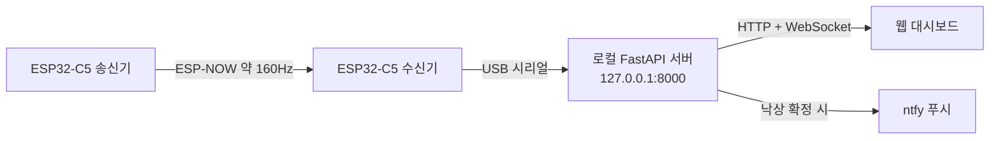
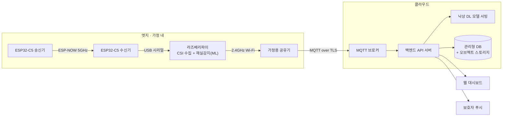

# CSI-Guard 구현 현황 및 완성 목표

**인프라 현황 · 목업 단계 완성 목표 · MLOps 완성 목표**

작성일 2026-07-29 · v1.1

> ## ⚠ §1·§2의 아키텍처 서술은 더 이상 현행이 아니다 (2026-09-10)
>
> 이 문서는 **전 구간이 단일 로컬 프로세스로 돌던 시절**을 기준으로 쓰였다. 그 뒤 4-레포
> 분리와 엣지/클라우드 분리가 실제로 구현되어, §1의 "영속 저장소 없음 · MQTT 미연동 ·
> 로컬 FastAPI 1개 프로세스"는 사실과 다르다.
>
> **현재 구현 상태의 정본은 [CSI-Guard_구현현황_v2.0_20260910.md](CSI-Guard_구현현황_v2.0_20260910.md) 다.**
>
> 다만 **§3~§5의 완성 목표 G1~G7과 우선순위는 여전히 유효**하며, 진척 상황은 v2.0 문서 §9에
> 표로 정리했다. 이 문서는 그 목표 정의의 원본으로 보존한다.

---

## 1. 현재 구현 단계 (인프라 측면)

전 구간이 **로컬에서 완결**되는 단일 기기 구성이다. 클라우드 서버·외부 DB·메시지 브로커를 쓰지 않으며, 외부로 나가는 통신은 낙상 확정 시의 ntfy 푸시 한 갈래뿐이다.

| 계층 | 현재 상태 |
|---|---|
| 하드웨어 | ESP32-C5 송수신 2대. ESP-NOW로 약 160Hz CSI 전송(실측 수신 약 167Hz), 수신기는 USB 시리얼로 호스트에 연결 |
| 수집 | 시리얼 포트 자동 탐지·자동 재연결, 30초 링버퍼 적재 |
| 처리 | 로컬 FastAPI 서버 1개 프로세스. 재실/움직임 감지와 DL 낙상 감지가 같은 버퍼를 소비 |
| 재실감지 | 규칙 기반(이동분산 + Welch PSD + 상태머신). **감지 유효 범위가 송수신 링크의 프레넬 존 내부에 사실상 한정** |
| 낙상감지 | DL 모델(`DualBranchResNet`) 로컬 추론, 실측 약 42ms/window |
| 인터페이스 | REST 19종 + WebSocket 1종(`/ws/live`, 10Hz) |
| 프런트엔드 | 웹 대시보드가 로컬 서버에 HTTP/WebSocket으로 직접 연결 |
| 알림 | ntfy 푸시(전용 스레드·큐, 실패 시 1/2/4초 백오프 3회 재시도) |
| 저장 | **영속 저장소 없음**. 세션(localStorage)을 제외한 모든 상태가 인메모리이며 새로고침 시 초기화 |
| 기기 관리 | MQTT **미연동**(UI 카드만 존재, 로컬 시리얼 구조 확정 전까지 비활성) |
| 배포 범위 | HOME(1거주자·1기기)만 실동작. FACILITY(다입소자·다기기)는 프런트엔드 목업 |

**요약**: 신호 수집 → 감지 → 표시 → 알림까지의 세로축은 실제로 동작하지만, 다기기·영속성·표준 프로토콜이라는 가로축 확장은 아직 없다. 감지 알고리즘 측면에서는 재실감지의 **공간 커버리지가 프레넬 존에 묶여 있다는 제약**이 남아 있다.

---

## 2. 타깃 아키텍처 — 엣지/클라우드 분리

완성 단계에서는 현재의 단일 로컬 프로세스를 **엣지와 클라우드로 분리**한다.

| 기능 | 실행 위치 | 이유 |
|---|---|---|
| CSI 수집 | **라즈베리파이**(수신기와 USB 시리얼 직결) | 현행 구조 그대로 이관 |
| **재실감지** | **라즈베리파이** | 상시 동작·저지연이 필요하고, 네트워크와 무관하게 끊기지 않아야 함(G7) |
| 클라우드 업링크 | 라즈베리파이 → 2.4GHz Wi-Fi → 공유기 → MQTT 브로커 | 가정 공유기 뒤 NAT에서 아웃바운드만 사용 |
| **낙상 DL 추론** | **클라우드** | 모델 갱신·공간별 적응 파라미터 배포를 중앙에서 관리(G4·G6) |
| 백엔드 API·저장소 | 클라우드 | 다기기·다입소자 이력 통합(G1·G3) |

**대역 분리가 설계상 유리한 점**: 감지 링크(ESP-NOW)는 5GHz, 업링크는 2.4GHz로 나뉜다. 업링크 트래픽이 감지에 쓰는 채널을 오염시키지 않으므로, 전송량이 늘어도 CSI 품질에 직접 영향을 주지 않는다. 다만 라즈베리파이와 수신기를 물리적으로 붙여 두므로, 2.4GHz 송신이 근거리 5GHz 수신에 미치는 영향은 실측으로 확인해야 한다.

**엣지가 라즈베리파이로 확정되면서 얻는 것**: 수신기 펌웨어를 바꾸지 않아도 된다. MQTT 클라이언트는 라즈베리파이에만 있으면 되고, 현행 `backend/`의 파이썬 신호처리 코드를 거의 그대로 이식할 수 있다.

> **이 전환의 대가**: "개인 행동 데이터가 외부로 나가지 않는다"는 기존 로컬 우선 서술이 더 이상 성립하지 않는다. 공모전 보고서 §5.4와 논문 초록의 관련 문구는 이 아키텍처 확정 후 함께 수정해야 한다.

---

## 3. 완성 목표 — 목업 단계 (서비스/인프라)

현재 UI만 존재하고 실동작이 없는 영역을 실서비스로 채우는 것이 목표다.

| # | 항목 | 현재 | 완성 목표 |
|---|---|---|---|
| G1 | 데이터 영속성 | 새로고침 시 초기화 | **클라우드 영속 저장소 도입**(후보 ERD 설계 완료), 이벤트·응답 이력 보존 |
| G2 | 기기 통신 | USB 시리얼 단일 링크 | **MQTT 기반 다기기 통합 관리** |
| G3 | FACILITY 다기기 관제 | 인메모리 시뮬레이션 | **다기기·다입소자를 동시에 수용하는 클라우드 실서비스 아키텍처**(백엔드 서버·낙상 모델 서빙 포함) |

---

## 4. 완성 목표 — MLOps 측면

| # | 항목 | 현재 | 완성 목표 |
|---|---|---|---|
| G4 | **낙상 모델**의 공간 적응 | 고정 임계값 캘리브레이션 | **캘리브레이션 이후 단계로 Few-shot / Online learning 확장** |
| G5 | 환경 변화 대응 | 사용자가 수동으로 재설정 | **드리프트 감지 자동화** |
| G6 | 모델 운용 | 체크포인트 파일 1개 직접 로드 | **모델 배포·버전 관리** |
| G7 | **재실감지** | 프레넬 존 내 규칙 기반 | **감지 공간 확장 + 동작·위치 강건성 확보, ML 전환 및 엣지 실행** |

### 4.1 G4 — 캘리브레이션 이후의 낙상 모델 적응

**적용 대상은 낙상 DL 모델에 한한다.** 재실감지 쪽 적응은 G7에서 별도로 다룬다.

현행 61초 캘리브레이션(퇴실 대기 → 명령 확인 → AGC 고정 → baseline 측정)은 **그대로 유지**한다. 이 절차가 산출하는 값은 재실/움직임 판정용 기준값이고, 여기에 **낙상 모델을 그 공간에 적응시키는 단계를 뒤에 덧붙이는 것**이 G4다.

| 구분 | 현재 | 완성 목표 |
|---|---|---|
| 절차 | 캘리브레이션 61초로 종료 | 캘리브레이션 **이후** 낙상 모델 적응 단계 추가 |
| 산출물 | 재실용 스칼라 임계값 2개 | 위 임계값 + **해당 공간에 적응된 낙상 모델 파라미터** |
| 방식 | 평균+k·표준편차(IQR 이상치 제거) | 설치 공간 데이터에 대한 **Few-shot** 또는 **Online learning** |
| 갱신 시점 | 설치·재설정 시 사용자가 수동 트리거 | 드리프트 감지(G5) 시 자동 재적응 |

**적응 신호는 설치 공간에서 수집한 CSI 자체**다. 사용자·보호자가 앱에서 남기는 응답(확인/출동/오탐지)은 **학습에 반영하지 않는다** — 응답 이력은 운영 지표와 사후 분석용으로만 유지한다.

### 4.2 G5 — 드리프트 감지 자동화

가구 배치 변경·RF 간섭·AGC 게인 변동 등으로 baseline이 현장을 더 이상 대표하지 못하는 상태를, 시스템이 스스로 감지해 재적응을 트리거하거나 사용자에게 제안한다. 현재는 사용자가 필요성을 직접 판단해 "장치 재설정"을 실행해야 한다.

### 4.3 G6 — 모델 배포·버전 관리

공간별 적응 결과를 아티팩트로 저장·배포·롤백할 수 있는 경로를 확보한다. 현재는 체크포인트 파일 1개를 경로로 직접 로드하는 구조여서, 적응 결과가 공간마다 달라지는 G4 이후에는 그대로 쓸 수 없다. 클라우드 모델 서빙과 엣지 재실 모델(G7) 두 갈래의 배포 대상이 생긴다는 점도 반영해야 한다.

### 4.4 G7 — 재실감지의 공간 확장·강건화·엣지 이관

**현재 한계**: 재실감지는 송수신 링크 주변의 **프레넬 존 내부**에서만 신뢰할 수 있게 동작한다. 사람이 링크를 가로지를 때는 CSI 진폭 변동이 뚜렷하지만, 존 바깥이나 링크와 평행하게 움직이는 경우·특정 자세에서는 같은 활동이라도 이동분산이 거의 반응하지 않는다. 즉 **감지 성능이 사람의 위치와 동작 방향에 강하게 의존**한다.

**목표**:

| 구분 | 현재 | 완성 목표 |
|---|---|---|
| 커버리지 | 프레넬 존 내부 | 실용화 가능한 생활 공간 전체 |
| 강건성 | 위치·동작 방향에 따라 감지율 편차 | 위치·자세·행위에 무관한 일관된 감지 |
| 판정 방식 | 규칙 기반(임계값 + 상태머신) | **머신러닝 기반**으로 전환 예상 |
| 실행 위치 | 호스트 PC의 로컬 서버 | **라즈베리파이**(수신기와 USB 직결) |

**엣지 실행의 부수 효과**: 재실감지가 엣지에서 끝나면 원시 CSI를 클라우드로 상시 전송할 필요가 없어진다. 활동이 감지된 구간만 낙상 판정용으로 올리는 게이팅이 가능해져, G2·G3의 대역폭 부담이 크게 줄어든다. 또한 네트워크가 끊겨도 "지금 사람이 있는가"라는 가장 기본적인 신호는 유지된다.

---

## 5. 우선순위 정리

| 순위 | 목표 | 근거 |
|---|---|---|
| 1 | G1 클라우드 영속 저장소 | 다른 모든 확장(이력·적응 데이터·다기기 상태)의 전제 |
| 2 | G7 재실감지 확장·엣지 이관 | 감지 커버리지는 제품 가치의 근간. 엣지 게이팅이 G2·G3의 설계 전제를 바꿈 |
| 3 | G4 낙상 모델 공간 적응 | 설치 환경 편차가 성능을 좌우하는 구조적 요인 |
| 4 | G6 모델 배포·버전 관리 | G4·G7의 산출물(공간별·엣지용 파라미터)을 다루려면 필수 |
| 5 | G2 MQTT | 다기기의 전제 조건. 펌웨어·엣지 협업이 필요해 선행 착수 |
| 6 | G3 클라우드 실서비스 | 시장 확장의 핵심이나 G1·G2가 선행되어야 안정적 |
| 7 | G5 드리프트 감지 | G4·G6가 있어야 "감지 후 재적응"이 의미를 가짐 |

각 목표의 수행 과정·필요 리소스·기술 스택은 `CSI-Guard_완성목표_실행계획_v1.0_20260729.md` 참조.

---

## 참고 문서

- `CSI-Guard_공모전_보고서_v1.0_20260715.md` §4(아키텍처), §7(개발 현황·향후 계획)
- `CSI-Guard_재실감지_알고리즘_상태머신_보고서_v2.0_20260720.md` §1~§4(재실 알고리즘·캘리브레이션)
- `CSI-Guard_기능정의서_HOME_v1.0_20260717.md` §1.2(구성 개요), §4(API 명세)
- `backend/README.md` (실행 옵션·ntfy 알림 동작)
