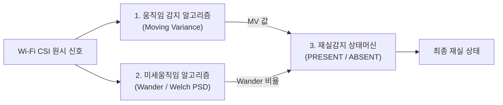
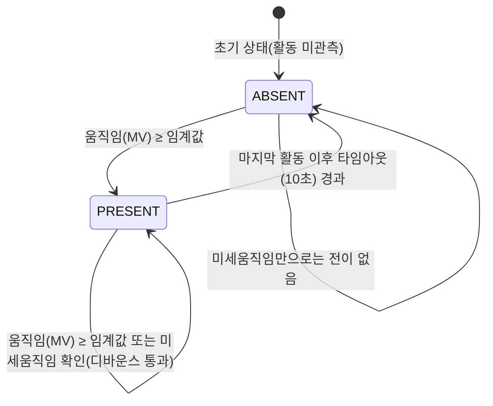

# CSI-Guard 재실감지 알고리즘 및 상태머신 보고서

**Wi-Fi CSI 기반 재실(Presence) 감지 — 움직임 알고리즘 · 미세움직임(Wander) 알고리즘 · 상태머신**

작성일 2026-07-20 · v2.0 (평가단 제공용, 개념·선정근거 중심으로 개정)

---

## 0. 문서 목적과 범위

이 문서는 CSI-Guard의 재실감지 서브시스템을 평가하는 전문가를 대상으로, 프로젝트 코드베이스에 대한 사전 지식 없이도 **어떤 원리로 동작하는지, 왜 그 알고리즘을 선택했는지**를 판단할 수 있도록 작성했다. 구현 세부(파일명·변수명·API 등)는 최소화하고, 대신 각 알고리즘이 기반한 신호처리·통계 개념과 대안 대비 선택 근거를 상세히 설명한다.

재실감지는 낙상 여부를 딥러닝으로 판정하는 낙상감지 모듈과는 **완전히 별개로 항상 동작하는 경량 규칙 기반(rule-based) 파이프라인**이다. "지금 이 공간에 사람이 있는가"라는 가장 기본적인 안전 신호이기 때문에, 무거운 딥러닝 모델의 로드 실패·업데이트 중단 같은 상황과 무관하게 끊김 없이 동작해야 한다는 요구사항이 알고리즘 설계 전반을 관통한다.

재실감지는 서로 다른 성격의 신호를 감지하는 두 개의 하위 알고리즘과, 그 둘의 결과를 하나의 최종 판정으로 합치는 상태머신으로 구성된다.



---

## 1. 움직임 감지 알고리즘 (Moving Variance 기반)

### 1.1 배경 개념 — CSI와 움직임의 관계

Wi-Fi Channel State Information(CSI)은 송신기와 수신기 사이 무선 채널이 각 부반송파(subcarrier)별로 신호를 어떻게 변형시키는지를 나타내는 값(진폭·위상)이다. 실내 공간에서는 신호가 벽·가구·사람 등에 반사되어 여러 경로(multipath)로 수신기에 도달하는데, 사람이 움직이면 그 다중경로의 길이와 반사 특성이 시시각각 바뀌면서 CSI 진폭이 흔들린다. 반대로 공간이 비어 있거나 사람이 완전히 정지해 있으면 다중경로 구조가 거의 고정되어 CSI 진폭도 안정적으로 유지된다. **"CSI 진폭의 시간적 변동성"이 곧 움직임의 대리 지표(proxy)가 된다**는 것이 이 알고리즘 전체의 출발점이다.

### 1.2 신호 전처리 — 왜 필요한가

원시 CSI는 그대로 쓰기 어려운 두 가지 문제가 있다.

- **샘플링 간격 불규칙**: 시리얼 통신·스케줄링 지연 등으로 프레임 도착 간격이 미세하게 흔들린다. 이후 필터링·주파수 분석이 균일한 샘플링 주기를 전제로 하므로, 먼저 선형보간으로 일정한 시간 간격(그리드)에 맞춰 재배치(resample)한다.
- **관심 대역 밖 성분**: 전원 노이즈, DC 오프셋, 초고주파 잡음 등 사람의 움직임과 무관한 성분이 섞여 있다. 4차 Butterworth 대역통과 필터(0.5~50Hz)로 이런 성분을 제거한다. 이 필터는 위상 왜곡이 없는 **영위상(zero-phase) 필터**를 사용하는데, 필터가 신호를 시간축에서 밀어버리면(위상 지연) 이후 "지금 이 순간의 움직임"을 판정하는 실시간 지표의 시점이 어긋나기 때문이다.

### 1.3 서브캐리어 선택 — 왜 모든 채널을 다 쓰지 않는가

CSI는 여러 개의 부반송파(서브캐리어)마다 별도의 값을 가진다. 그런데 모든 서브캐리어가 움직임에 똑같이 민감한 것은 아니다 — 어떤 서브캐리어는 사람이 지나갈 때 크게 흔들리고, 어떤 서브�레리어는 주변 잡음 외에는 거의 반응하지 않는다. 관계없는 서브캐리어를 그대로 합산하면 신호(움직임) 대비 잡음의 비율이 오히려 나빠진다.

이를 정량화하기 위해 서브캐리어별로 다음 지표(q-value)를 계산한다.

```
q = (해당 서브캐리어의 이동분산 최댓값) / (해당 서브캐리어의 이동분산 평균값)
```

q-value가 크다는 것은 "평상시엔 잠잠하다가 움직임이 있을 때만 뚜렷하게 튀는" 서브캐리어라는 뜻이다. 이 값이 상위인 서브캐리어 10개만 골라 이후 계산에 사용한다. 이는 복잡한 학습 과정 없이도 **설치할 때마다 달라지는 채널 특성에 맞춰 자동으로 가장 유효한 신호만 골라내는** 적응적 선택이다.

### 1.4 이동분산(Moving Variance) — 움직임 지표의 핵심

선택된 서브캐리어들을 합산·정규화(z-score)한 하나의 시계열에 대해, 다음과 같은 이동분산을 계산한다.

```
υ(n; W) = (1 / 2W) · Σ_{k=n-W}^{n+W} (|h[k]| − μ_h(n))²
```

여기서 `μ_h(n)`은 시점 `n`을 중심으로 한 국소 구간(반폭 W)의 평균이다. 즉 전체 신호의 분산이 아니라, **매 시점마다 그 주변 짧은 구간(약 0.5초)의 국소적 변동성**을 계산하는 것이 핵심이다.

통계적으로 분산(variance)은 "값이 평균에서 얼마나 흩어져 있는가"를 나타내는 표준 지표다. 사람이 정지해 있을 때 CSI 진폭은 열잡음 수준의 미세한 흔들림만 있어 분산이 낮게 유지되고, 사람이 움직이면 진폭이 크게 요동쳐 국소 분산이 급격히 커진다. 즉 이동분산은 "지금 이 순간 신호가 얼마나 요동치고 있는가"를 정량화한, 움직임 검출에 자연스럽게 대응되는 통계량이다. 이 값의 가장 최근 시점 값(`mv_current`)을 움직임 판정에 사용한다.

### 1.5 알고리즘 선택 이유

이동분산 기반 규칙 판정을 채택한 이유는 다음 네 가지다.

1. **실시간성**: 0.25초마다 3초 윈도우를 다시 계산해야 하는 상시 루프에서, 이동분산은 컨볼루션 한 번으로 계산되는 매우 가벼운 연산이다. 딥러닝 추론 대비 지연·자원 소모가 훨씬 적어, "항상 켜져 있어야 하는" 재실감지의 요구사항에 부합한다.
2. **설치환경 독립적 적응**: 이동분산 자체는 학습이 필요 없는 통계량이며, 판정 임계값만 설치 시 캘리브레이션(§1.6, 조용한 방에서 측정한 baseline)으로 그 공간에 맞춰 자동 산출한다. 딥러닝 분류기처럼 다양한 설치 환경을 아우르는 대규모 학습 데이터가 없어도 즉시 배치 가능하다.
3. **해석 가능성(interpretability)**: 임계값을 넘었는지 여부로 판정이 결정되므로, 오탐/미탐이 발생했을 때 "왜 그렇게 판정했는가"를 값 하나로 바로 설명할 수 있다. 안전 신호를 다루는 시스템에서 판정 근거를 설명할 수 있다는 점은 신뢰성 측면에서 중요하다.
4. **낙상 감지 모듈과의 독립성 요구**: 재실감지는 딥러닝 낙상 모델의 가용성과 무관하게 동작해야 하므로,애초에 무거운 모델에 의존하지 않는 경량 알고리즘이어야 한다는 아키텍처 제약과도 부합한다.

절대 임계값(고정된 하나의 숫자를 모든 설치 환경에 적용) 대신, 설치 공간마다 캘리브레이션으로 임계값을 새로 산출하는 방식을 택한 이유도 같은 맥락이다 — 가구 배치·벽 재질·Wi-Fi 신호 세기 등 환경 요인에 따라 "정지 상태의 잡음 수준" 자체가 달라지므로, 하나의 고정값으로는 어떤 환경에서는 과민(오탐 과다), 어떤 환경에서는 둔감(미탐 과다)해질 수밖에 없다.

### 1.6 알고리즘 상세 절차 및 파라미터

지금까지 설명한 개념들이 실제로는 다음과 같은 순서의 절차로 실행된다. 매 판정 주기(0.25초)마다 최근 3초 구간을 새로 가져와 아래 6단계를 처음부터 다시 계산한다.

1. **리샘플링**: 불규칙한 타임스탬프의 CSI 프레임을 100Hz 균일 그리드로 재배치한다.
2. **대역통과 필터링**: 0.5~50Hz 대역만 남기는 4차 Butterworth 영위상 필터를 적용한다.
3. **서브캐리어 선택**: q-value가 높은 상위 10개 서브캐리어를 고른다.
4. **합산·정규화**: 선택된 서브캐리어를 합산한 뒤 z-score로 정규화해 하나의 시계열을 만든다.
5. **이동분산 계산**: 반폭 0.5초 기준으로 이동분산 시계열을 구하고, 그중 가장 최근 시점 값을 취한다.
6. **판정**: 이 값이 판정 임계값(`presence_mv_threshold`) 이상이면 "움직임 있음"으로 이 신호를 상태머신(§3)에 전달한다.

**파라미터 요약**

| 파라미터 | 기본값 | 의미 |
|---|---:|---|
| 관측 윈도우 길이 | 3초 | 매 판정에 사용하는 CSI 구간 길이 |
| 이동분산 반폭 산출 기준 | 0.5초 | 이동분산 계산 시 국소 구간의 폭 |
| 리샘플링 주파수 | 100Hz | 균일 그리드 목표 샘플링 레이트 |
| 대역통과 필터 | 0.5~50Hz, 4차 | 관심 없는 성분 제거 범위 |
| 선택 서브캐리어 수 | 10개 | q-value 상위 N개 |
| 판정 주기(stride) | 0.25초 | 위 6단계를 반복하는 주기 |
| 판정 임계값(`presence_mv_threshold`) | 2.0 | 설치 시 캘리브레이션으로 공간별로 재산출됨(아래) |

**임계값은 어떻게 정해지는가 — 캘리브레이션**: 판정 임계값은 고정된 상수가 아니라, 장치를 설치할 때(또는 재설정할 때) 사람이 없는 조용한 상태를 약 30초간 측정해 자동으로 산출한다. 이 30초 구간에 대해 위 1~5단계와 동일한 계산을 수행해 이동분산 시계열을 얻은 뒤, 그 시계열의 `평균 + k·표준편차`(k=2.0)를 임계값으로 삼는다. 다만 조용한 구간에도 문 닫힘 같은 일시적 스파이크가 섞일 수 있어, 평균·표준편차를 구하기 전에 사분위범위(IQR) 기준으로 이상치를 먼저 제거한다 — 이상치를 걷어내지 않으면 임계값이 실제 정상 잡음 수준보다 불필요하게 높게(둔감하게) 잡히기 때문이다. 계산된 값이 지나치게 작아지는 것을 막기 위한 최소 하한값도 함께 적용한다.

---

## 2. 미세움직임 알고리즘 (Wander)

### 2.1 필요성 — 움직임 감지의 한계

이동분산 기반 움직임 감지는 걷기·자세 전환처럼 **몸통 전체가 크게 이동하는 움직임(gross motion)**에는 안정적으로 반응한다. 신체 표면 중 다중경로 변화에 크게 기여하는 부위는 몸통처럼 면적이 넓고 이동 거리가 큰 부위이기 때문에, 이동분산은 사실상 "몸통 단위의 굵직한 움직임"에 선택적으로 민감한 지표에 가깝다. 반대로 사람이 자리에 앉거나 누운 채로 손을 움직이거나 다리를 떠는 등 **몸통은 고정한 채 팔다리만 움직이는 국소적인 동작**에는 상대적으로 둔감해, 이런 상황에서는 이동분산 값이 정지 상태와 거의 구분되지 않을 정도로 낮게 유지될 수 있다. 그 결과 실제로는 사람이 활동 중인데도 "부재중"으로 잘못 판정할 위험(미탐)이 생긴다. 미세움직임(wander) 알고리즘은 이동분산이 놓치는 이런 국소적·미세한 움직임을 보완하기 위한 신호다.

### 2.2 미세움직임의 신호적 근거 — 호흡과 팔다리의 미세 움직임

사람이 몸통을 크게 움직이지 않아도 신체에서는 두 종류의 저진폭 신호가 계속 발생한다.

- **호흡**: 흉곽의 주기적인 팽창·수축은 미세하지만 지속적으로 신체 표면과 주변 다중경로 구조를 변화시키고, 이는 CSI에 매우 낮은 진폭의 **준주기적(quasi-periodic) 저주파 성분**으로 나타난다. 성인의 안정 시 호흡수는 대략 분당 12~20회, 즉 **0.2~0.33Hz**에 해당하며, 이 알고리즘이 측정하는 대역(0.1~0.5Hz)은 고령자의 느린 호흡부터 다소 빠른 호흡까지(분당 약 6~30회) 여유 있게 포함하도록 설계되어 있다.
- **팔다리의 미세 움직임**: 손짓, 다리 떨림, 앉은 자세에서의 미세한 조정처럼 몸통 이동 없이 사지만 움직이는 동작도 마찬가지로 저진폭 CSI 변동을 만든다. 몸통 움직임만큼 크지는 않지만 완전한 정지 상태보다는 뚜렷하게 큰 저주파 변동이라는 점에서 호흡 신호와 같은 대역에서 함께 관측된다.

즉 미세움직임 알고리즘은 "호흡만" 검출하는 좁은 의미의 생체신호 알고리즘이 아니라, **몸통은 고정된 채 이뤄지는 모든 저진폭 국소 움직임(호흡 + 팔다리 움직임)을 포괄적으로 검출**하도록 설계된 알고리즘이다. 이 구분이 §3의 상태머신 설계 — 어떤 신호를 신규 재실 판정에 쓰고 어떤 신호를 재실 유지·퇴실 판정에 쓸지 — 를 결정짓는 핵심 근거가 된다.

### 2.3 왜 시간영역이 아닌 주파수영역인가 — Welch PSD

호흡 신호는 진폭이 매우 작아 이동분산(시간영역에서 값의 흩어짐 정도)으로는 잘 드러나지 않는다. 반면 호흡은 "특정 주파수 대역에서 반복되는" 준주기적 신호이므로, 시간영역이 아니라 **주파수영역에서 에너지가 어디에 몰려 있는지**를 보면 훨씬 잘 드러난다. 이를 위해 파워 스펙트럼 밀도(Power Spectral Density, PSD)를 추정하는 Welch 방법을 사용한다.

Welch PSD는 신호를 주파수 성분별 에너지 분포로 변환하는 방법으로, 단순 FFT보다 잡음에 강건하도록 설계된 추정 기법이다(일반적으로는 신호를 여러 구간으로 나눠 평균 내는 방식을 쓰지만, 재실감지에서는 반응성을 우선해 구간을 나누지 않는 단일 세그먼트 방식을 쓴다 — §2.6 참고). 관심 대역(0.1~0.5Hz)에 해당하는 PSD 값을 적분하면, "그 주파수 대역에 얼마나 많은 에너지가 실려 있는가"를 하나의 스칼라 값으로 얻을 수 있다. 이 값이 크다는 것은 해당 저주파 대역에서 준주기적인 신호(호흡 등)가 뚜렷하게 존재한다는 뜻이다.

### 2.4 이중 대역 설계 — 넓게 거르고 좁게 잰다

미세움직임 신호체인은 두 단계의 서로 다른 폭을 가진 대역을 사용한다.

1. **사전필터(prefilter)**: 0.05~5Hz의 비교적 넓은 대역으로 먼저 걸러낸 뒤 정규화한다.
2. **측정 대역**: 그중 0.1~0.5Hz라는 훨씬 좁은 대역만 골라 PSD 에너지를 적분한다.

두 대역을 같게(둘 다 0.1~0.5Hz) 만들면 안 되는 이유가 있다. 사전필터 단계에서 이미 신호 에너지 전체가 그 좁은 대역 안에 갇힌 채로 정규화되어 버리면, 그 이후 같은 대역에서 다시 에너지를 측정해도 입력이 어떻든 거의 비슷한 값이 나와 **측정값이 실제 신호 세기와 무관해지는(구분력 상실)** 문제가 생긴다. 넓은 대역으로 먼저 걸러 정규화의 기준이 되는 "전체 에너지"를 왜곡 없이 유지한 뒤, 그 안에서 좁은 관심 대역만 따로 측정해야 실제 호흡 성분의 강약이 측정값에 그대로 반영된다.

### 2.5 상대적(비율) 임계값 — 왜 절대값이 아닌가

움직임 알고리즘은 절대 임계값을 쓰지만, 미세움직임은 **캘리브레이션으로 측정한 "조용한 방" 기준값(baseline) 대비 비율**로 판정한다(`현재 값 / baseline ≥ 배수`). 호흡으로 인한 CSI 변화는 이동분산 대비 신호 자체가 훨씬 미세해서, 설치 환경의 배경 잡음 수준(가구 재질, 벽 반사, Wi-Fi 신호 세기 등)에 따라 절대적인 수치 자체가 크게 달라진다. 절대 임계값 하나로는 어떤 환경에서는 배경 잡음조차 넘어서 오탐이 나고, 어떤 환경에서는 실제 호흡 신호조차 못 넘는 상황이 생길 수 있다. 캘리브레이션 시점의 "사람이 없는 조용한 상태" 값을 기준(1배)으로 삼고, 그 대비 상대적으로 얼마나 커졌는지를 보는 방식이 설치 환경 차이를 자연스럽게 정규화한다.

### 2.6 알고리즘 선택 이유 요약

- 시간영역 지표(이동분산)로는 놓치는 저진폭·준주기 신호(호흡)를, 주파수영역 접근으로 보완해 정적 재실 상황의 미탐을 줄인다.
- Welch PSD는 FFT 대비 잡음에 상대적으로 강건하면서도, 단일 세그먼트 방식을 택해 다중 세그먼트 평균화로 인한 지연 없이 매 틱(0.25초)마다 반응할 수 있게 했다 — 정확도(분산 감소)보다 반응성을 우선한 절충이다.
- 이동분산과 마찬가지로 학습 데이터 없이도 신호처리 이론만으로 설계·검증 가능해, 움직임 알고리즘과 동일한 "경량·해석 가능·즉시 배치 가능" 원칙을 공유한다.

### 2.7 알고리즘 상세 절차 및 파라미터

미세움직임 알고리즘도 매 판정 주기(0.25초)마다 아래 순서로 계산되지만, §1.6의 움직임 알고리즘과는 관측 윈도우 길이와 대역이 다르고, 시간영역이 아닌 주파수영역 계산이 추가된다.

1. **윈도우 취득**: 최근 10초 구간의 CSI를 가져온다(움직임 알고리즘의 3초보다 길다 — 저주파 성분을 측정하려면 그 주기를 여러 번 담을 만큼 긴 구간이 필요하기 때문).
2. **사전필터링·정규화**: 0.05~5Hz의 넓은 대역으로 걸러낸 뒤 z-score 정규화한다(§2.4의 이유로, 최종 측정 대역보다 넓게 잡는다).
3. **좁은 대역 파워 측정**: 0.1~0.5Hz 구간만 잘라 Welch PSD를 적분해 스칼라 값(`wander_current`)을 얻는다.
4. **비율 계산**: `wander_ratio = wander_current / wander_baseline`.
5. **활성 후보 판정**: `wander_ratio`가 판정 배수(`wander_ratio_threshold`) 이상이면 "활성 후보"로 표시한다.
6. **디바운스**: 활성 후보 상태가 최소 지속시간 동안 끊김 없이 유지되어야 비로소 "확인된 활동"(`wander_confirmed`)으로 인정하고, 이 결과를 상태머신(§3)에 전달한다.

**파라미터 요약**

| 파라미터 | 기본값 | 의미 |
|---|---:|---|
| 관측 윈도우 길이 | 10초 | 저주파 성분 측정을 위해 움직임 알고리즘보다 긴 구간 사용 |
| 사전필터 대역 | 0.05~5Hz | 정규화 왜곡을 막기 위한 넓은 사전 대역 |
| 측정(적분) 대역 | 0.1~0.5Hz | 호흡 주파수를 포함하도록 설계된 좁은 관심 대역 |
| 판정 배수(`wander_ratio_threshold`) | 1.8배 | baseline 대비 몇 배 이상이면 활성으로 볼지 |
| 디바운스 최소 지속시간 | 2초 | 순간 스파이크를 걸러내는 데 필요한 지속시간 |
| 기준값(`wander_baseline`) | 0.5 | 설치 시 캘리브레이션으로 공간별로 재산출됨(아래) |

**임계값(baseline)은 어떻게 정해지는가**: §1.6의 MV 임계값 산출과 동일한 30초 "조용한 방" 측정 구간을 함께 사용하지만, 산출 방식은 다르다. MV는 30초 동안 시간에 따라 변하는 이동분산 "시계열"을 얻을 수 있어 평균·표준편차 계산이 가능한 반면, Wander는 한 윈도우(10초)당 Welch PSD 적분값 하나만 나오는 "스칼라"라서 평균 낼 시계열 자체가 없다. 따라서 이 스칼라 값 자체(단, 지나치게 작아지지 않도록 최소 하한을 적용한 값)를 그대로 `wander_baseline`으로 사용한다.

---

## 3. 재실감지 상태머신

### 3.1 상태머신 개념

상태머신(Finite State Machine, FSM)은 시스템이 가질 수 있는 상태들과, 어떤 조건에서 한 상태에서 다른 상태로 전이하는지를 규칙으로 정의한 모델이다. 재실감지는 PRESENT(재실)/ABSENT(퇴실) 단 두 개의 상태만을 가지는 단순한 FSM이지만, 그 전이 조건은 앞서 설명한 두 개의 독립적인 신호(움직임, 미세움직임)를 어떻게 조합할지를 결정하는 핵심 판단 로직을 담고 있다.

두 신호를 단순히 "둘 중 하나라도 임계값을 넘으면 무조건 재실"로 처리하지 않고, 아래와 같이 **두 신호가 서로 다른 종류의 움직임을 감지한다는 점**을 반영한 비대칭 규칙을 둔 이유를 설명한다.

### 3.2 두 신호가 감지하는 움직임의 종류가 다르다 — 왜 대칭적으로 다루지 않는가

비대칭 규칙의 근거는 신호의 정확도·정밀도 차이가 아니라, **두 신호가 애초에 서로 다른 종류의 신체 움직임에 반응하도록 설계되어 있다는 점**이다(§1.1, §2.1).

- **움직임(MV) 신호**: 몸통 전체가 크게 이동하는 gross motion에 강건하다. 사람이 문을 열고 들어와 방을 가로질러 걷는 등 **새로 공간에 들어오는 행위는 거의 예외 없이 몸통 단위의 큰 움직임을 동반**하므로, "지금까지 아무도 없던 상태에서 새로 사람이 들어왔다"는 판단(ABSENT→PRESENT)의 증거로는 MV가 가장 신뢰할 수 있는 신호다. 반대로 이미 자리에 앉거나 누운 사람이 손이나 다리만 움직이는 국소적인 동작에는 MV가 상대적으로 반응하지 않는다(§2.1) — 즉 MV만으로는 "이미 재실 중인 사람이 계속 있는지"를 놓칠 수 있다.
- **미세움직임(Wander) 신호**: 호흡뿐 아니라 몸통 이동이 없는 손·다리의 미세한 움직임까지 함께 포착하도록 설계되어 있다(§2.2). 반면 새로운 입장(entry) 자체를 판단하는 데는 적합하지 않다 — 이 신호는 몸통이 움직이지 않는 상태에서의 저진폭 변동을 재는 지표이므로, 애초에 몸통이 문턱을 넘어 들어오는 큰 동작 자체를 구분해 낼 근거가 되지 못한다.

즉 두 신호는 "어느 쪽이 더 정확한가"의 문제가 아니라 **"어느 쪽이 그 판단에 필요한 움직임의 종류를 실제로 감지하는가"**의 문제이며, 이 감지 대상의 차이를 그대로 상태전이 규칙에 반영한 것이 아래 표다.

| 신호 | ABSENT → PRESENT (신규 재실 판정) | PRESENT 상태 유지 · ABSENT 전이 판단 |
|---|:---:|:---:|
| 움직임(MV) ≥ 임계값 | ✅ 가능 — 입장은 몸통 단위 움직임을 동반하므로 MV가 근거가 된다 | ✅ 가능 |
| 미세움직임(Wander) 조건 충족 | ❌ 불가 — 몸통의 입장 동작 자체를 구분하는 신호가 아니다 | ✅ 가능(단, 이미 PRESENT일 때만) — 손·다리의 미세 움직임이 이어지는 한 "아직 재실 중"으로 유지시켜 퇴실(ABSENT) 전이를 보류시킨다 |

풀어 말하면: **새 재실 판정(ABSENT→PRESENT)은 몸통 움직임을 필요조건으로 삼기 때문에 MV만으로 결정**한다. 반면 **재실 유지와 실제 퇴실(PRESENT→ABSENT) 시점의 판단은 몸통이 정지한 상태에서도 계속될 수 있는 손·다리의 미세 움직임까지 반영**해야 하므로, Wander가 함께 참여한다 — 사람이 몸통은 고정한 채 손이나 다리만 움직이고 있는 동안에는 Wander가 활동시각을 계속 갱신해 §3.5의 타임아웃에 의한 ABSENT 전이를 유예시키고, 몸통 움직임과 손·다리 움직임이 모두 일정 시간 없을 때 비로소 ABSENT로 전이한다.

### 3.3 스무딩 — 순간 노이즈로 인한 상태 진동 방지

움직임 신호는 판정에 쓰이기 전, 가장 최근 3개 측정값을 가중평균(최신값 40%, 그 이전 두 값 각 30%)해 완만하게 만든다. 원시 측정값 하나하나를 그대로 임계값과 비교하면, 순간적인 잡음 한 틱만으로도 상태가 PRESENT↔ABSENT를 빠르게 오가는 "떨림(flapping)" 현상이 생길 수 있다. 최신 값에 더 큰 가중치를 주어 반응성은 유지하면서도, 직전 몇 틱을 함께 반영해 단발성 잡음의 영향을 줄이는 절충이다.

### 3.4 디바운스 — 미세움직임 신호의 순간 튐 방지

미세움직임 신호는 임계값을 넘긴 상태가 **최소 지속시간(기본 2초) 동안 끊김 없이 유지**되어야 비로소 "확인된 활동"으로 인정한다(디바운스, debounce). §2.3에서 설명했듯 이 신호는 단일 세그먼트 추정이라 분산이 커서, 순간적인 스파이크만으로 조건을 만족하는 경우가 있다. 최소 지속시간 조건은 스위치 입력의 채터링을 걸러내는 디바운스 회로와 같은 원리로, "일시적으로 튄 값"과 "실제로 지속되는 손·다리의 움직임"을 구분해 §3.2에서 Wander에 재실 유지·퇴실 판단을 맡기는 정책이 순간 노이즈에 흔들리지 않도록 뒷받침한다.

### 3.5 타임아웃 기반 ABSENT 전이 — 히스테리시스

마지막 활동이 감지된 시각으로부터 일정 시간(기본 10초)이 지나야 ABSENT로 전이한다. 활동이 감지되지 않는 즉시 ABSENT로 바꾸지 않는 이유는, 사람이 잠깐 완전히 정지해 있는 짧은 순간(예: 숨을 참거나, 두 신호 모두가 우연히 임계값 아래로 떨어지는 찰나)에도 실제로는 방을 나간 것이 아니기 때문이다. 이런 지연 전이는 신호처리에서 **히스테리시스(hysteresis)**라 부르는 기법으로, 판정 경계 부근에서 상태가 지나치게 민감하게 반응하는 것을 막는 표준적인 안정화 방법이다.

### 3.6 상태 전이 다이어그램



### 3.7 설계가 달성하는 것

이 세 가지 안정화 장치(스무딩·디바운스·타임아웃)와, 감지 대상 움직임의 종류에 따라 신호를 나눠 맡기는 §3.2의 비대칭 정책을 종합하면, 재실감지 상태머신은 다음 두 실패 모드를 동시에 억제하도록 설계되어 있다.

- **오탐(false positive) 억제**: 순간적인 잡음이나 일시적 진동만으로 "없던 사람이 갑자기 생기는" 오판정이 나지 않도록, 신규 재실 판정은 실제 입장 행위에서만 발생하는 몸통 단위 움직임(MV)과 스무딩을 거치게 한다.
- **미탐(false negative) 억제**: 몸통은 고정한 채 손·다리만 움직이고 있는 상황에서 "있는 사람을 없다고" 판정하지 않도록, 그런 움직임까지 포착하는 미세움직임 신호가 이미 확인된 재실 상태를 유지시켜 퇴실 전이를 유예한다.

두 목표는 본질적으로 상충하는 방향(민감도를 올리면 오탐이 늘고, 낮추면 미탐이 는다)이라, 하나의 신호·임계값만으로는 동시에 만족시키기 어렵다. 이 설계는 "신규 판정"과 "재실 유지·퇴실 판정"이라는 서로 다른 국면에, 그 국면에서 실제로 유의미한 움직임을 감지하는 신호를 각각 배정함으로써 두 목표를 함께 달성하려는 접근이다.

### 3.8 상태 갱신 알고리즘 — 전체 절차

앞의 §3.2~3.5에서 개념별로 설명한 스무딩·비대칭 융합·디바운스·타임아웃을 하나의 절차로 합치면, 상태머신은 매 판정 주기(0.25초)마다 다음 6단계를 순서대로 수행한다. 입력은 §1.6에서 산출된 움직임 값(MV)과 §2.7에서 산출된 미세움직임 비율(Wander)이다.

1. **MV 스무딩**: 이번 틱을 포함한 최근 3개의 MV 값을 가중평균한다 — 최신값 40%, 그 이전 두 값 각 30%. 그 결과를 `smoothed_MV`라 한다.
2. **Wander 비율 계산**: `wander_ratio = wander_current / wander_baseline`을 구한다.
3. **Wander 디바운스 판정**: `wander_ratio`가 `wander_ratio_threshold`(1.8배) 이상인 상태가 `wander_min_duration_s`(2초) 이상 끊김없이 지속되었는지 확인해 `wander_confirmed`(참/거짓)를 정한다.
4. **활동시각 갱신 — 비대칭 규칙 적용** (§3.2의 정책을 실제 조건문으로 표현하면):
   - `smoothed_MV ≥ mv_threshold`이면 → 현재 상태가 PRESENT든 ABSENT든 관계없이 `마지막 활동 시각`을 지금 시각으로 갱신한다.
   - 그렇지 않고, 현재 상태가 이미 PRESENT이며 `wander_confirmed = 참`이면 → 마찬가지로 `마지막 활동 시각`을 지금 시각으로 갱신한다.
   - 위 두 조건에 모두 해당하지 않으면 → `마지막 활동 시각`을 그대로 둔다(갱신하지 않음).
5. **상태 판정**: `(지금 시각 − 마지막 활동 시각) < presence_timeout_s`(10초)이면 상태를 PRESENT로, 그렇지 않으면 ABSENT로 정한다.
6. **전이 이벤트 출력**: 방금 정해진 상태가 바로 직전 틱의 상태와 다르면 "상태가 바뀌었음" 플래그를 함께 출력한다 — 이 플래그가 대시보드 갱신·로그 기록 등 후속 동작의 트리거가 된다.

이 6단계가 §3.2의 표(신규 판정은 MV만, 유지는 MV 또는 Wander)와 §3.3~3.5의 스무딩·디바운스·타임아웃을 정확히 구현하는 절차이며, 매 0.25초마다 처음부터 반복된다.

**상태머신 파라미터 요약**

| 파라미터 | 기본값 | 의미 |
|---|---:|---|
| MV 스무딩 가중치 | 0.4 / 0.3 / 0.3 | 최신 → 과거 순으로 최근 3개 값에 적용 |
| Wander 디바운스 최소 지속시간 | 2초 | §2.7의 `wander_min_duration_s` |
| ABSENT 전이 타임아웃 | 10초 | `presence_timeout_s` |
| 판정 주기(stride) | 0.25초 | 6단계 전체를 반복하는 주기 |

---

## 4. 캘리브레이션의 역할과 절차

§1.6과 §2.7에서 각각 "임계값은 어떻게 정해지는가"를 알고리즘별로 설명했다. 이 절에서는 그 산출 과정을 하나의 절차로 모아 정리하고, 특히 지금까지 다루지 않은 **AGC(자동 이득 제어) 고정 로직**을 상세히 설명한다.

### 4.1 캘리브레이션이 하는 일 — 요약

캘리브레이션은 알고리즘 자체(이동분산, Welch PSD, 상태머신 규칙)를 바꾸지 않는다. 대신 두 알고리즘이 판정 기준으로 쓰는 두 개의 숫자 — `presence_mv_threshold`(§1)와 `wander_baseline`(§2) — 를 **설치된 공간의 실제 조건에 맞게 한 번 측정해서 확정**하는 과정이다. 가구 배치·벽 재질·Wi-Fi 신호 세기가 설치 공간마다 다르므로, 이 두 숫자를 모든 설치 환경에 동일하게 고정해 두면 어떤 공간에서는 과민(오탐 과다), 어떤 공간에서는 둔감(미탐 과다)해질 수밖에 없다(§1.5, §2.5) — 캘리브레이션은 이 문제를 "설치 시 한 번, 그 공간을 직접 측정"하는 방식으로 해결한다.

### 4.2 4단계 절차

장치를 처음 등록하거나 "장치 재설정"을 실행하면 다음 4단계가 순서대로, 자동으로 진행된다(총 약 61초).

| 단계 | 소요 시간 | 목적 |
|---|---:|---|
| ① 퇴실 대기(leaving) | 30초 | 설치자가 물리적으로 공간을 비울 시간을 확보한다. 이 단계가 끝나기 전에는 어떤 측정도, 장치에 대한 명령도 시작되지 않는다. |
| ② 명령 확인(waiting_ack) | 약 0.2초 | 수신기에 "측정 시작(train)" 명령을 보낸 뒤, 그 명령이 실제로 도달해 장치가 스트리밍을 멈췄는지 확인한다. |
| ③ AGC 안정화(waiting_agc) | 약 1초 | 장치가 현재 공간의 RF 환경에 맞춰 **AGC(자동 이득 제어) 게인을 재설정하고 고정**한 뒤 스트리밍을 재개할 때까지 기다린다 — §4.3에서 상세히 설명한다. |
| ④ baseline 측정(measuring) | 30초 | AGC가 고정되어 안정된 상태에서, 조용한 방의 CSI를 수집해 `presence_mv_threshold`/`wander_baseline`을 산출한다. |

### 4.3 AGC 고정 로직 — 왜 필요한가

**AGC(Automatic Gain Control, 자동 이득 제어)**는 무선 수신기가 수신 신호의 세기에 맞춰 내부 증폭기의 이득(gain)을 자동으로 조절하는 회로다. 신호가 너무 약하면 증폭해 노이즈에 묻히지 않게 하고, 너무 강하면 감쇠해 포화(saturation)되지 않게 하여, 수신 신호를 항상 처리하기 적절한 범위 안에 유지하는 것이 목적이다. 거의 모든 무선 수신기(Wi-Fi 포함)에 기본적으로 내장되어 있는 기능이다.

문제는, 이 게인이 CSI를 측정하는 도중에 바뀌면 어떻게 되는가다. 이동분산(§1.4)과 Welch PSD 밴드 에너지(§2.3)는 모두 "CSI 진폭이 시간에 따라 얼마나 흔들리는가"를 재는 지표다. 그런데 AGC가 게인을 한 단계 조정하는 순간, 실제 공간에서는 아무 일도 일어나지 않았는데도 CSI 진폭이 계단형으로 갑자기 뛰거나 떨어진다. 이 인공적인 계단은 사람의 움직임과 전혀 무관하지만, 이동분산·Welch PSD 관점에서는 "큰 변동"으로 그대로 잡힌다. 만약 이런 게인 변화가 캘리브레이션의 30초 baseline 측정 구간에 섞여 들어가면, "조용한 방"을 측정한 결과인데도 실제보다 훨씬 크게 흔들리는 것처럼 왜곡된 값이 나와 `presence_mv_threshold`/`wander_baseline`이 잘못 산출된다.

이를 막기 위해, 수신기는 "train" 명령을 받으면 곧바로 baseline 측정에 들어가지 않는다. 먼저 스트리밍을 멈추고, 현재 공간의 RF 환경(조용한 상태)에 맞춰 AGC 게인을 한 번 정착시켜 **그 값으로 고정**한 뒤에야(약 1초의 AGC 안정화 시간) 스트리밍을 재개한다. 이어지는 30초의 baseline 측정은 이렇게 게인이 이미 고정되어 더 이상 변하지 않는 안정적인 상태 위에서만 이뤄지므로, 측정된 변동이 온전히 실제 신호(또는 진짜 정적 잡음)만을 반영하게 된다.

**AGC 고정이 갖는 의미는 측정 순간에서 끝나지 않는다.** `presence_mv_threshold`/`wander_baseline`은 "이 공간에서, 이 게인으로 고정된 상태에서, 사람이 없을 때 신호가 이 정도로 흔들린다"는 기준값이다. 따라서 캘리브레이션 이후의 실시간 감지도 같은 고정된 게인 조건에서 이뤄져야만 이 기준값과의 비교가 의미를 가진다. 만약 게인이 캘리브레이션 이후에도 계속 자동으로 바뀐다면, 시간이 지나면서 baseline과 실시간 값의 스케일이 서서히 어긋나는 드리프트가 생길 수 있다 — 이는 공모전 보고서(§2.2)에서 언급한 "데이터 시프트"의 구체적인 물리적 원인 중 하나이며, 가구 배치 변경 등과 함께 재캘리브레이션(§4.5)이 필요한 이유이기도 하다.

다만 이 단계에는 한 가지 한계가 있다. 시스템은 "AGC 안정화 단계가 실제로 얼마나 걸렸는지"(관측 시간)는 기록하지만, 장치의 AGC 재설정이 실제로 올바르게 완료되었는지를 장치로부터 직접 확인받을 방법은 없다 — 소요 시간이 예상 범위(약 1초) 안에 들었는지로 "정상처럼 보이는지"를 간접적으로만 판단한다.

### 4.4 캘리브레이션 산출값과 알고리즘의 연결

AGC가 고정된 뒤 확보한 30초 baseline 구간으로부터, 두 알고리즘은 서로 다른 방식으로 각자의 기준값을 산출한다(상세 수식은 §1.6/§2.7 참고).

| 산출값 | 사용 알고리즘 | 산출 방식 요약 |
|---|---|---|
| `presence_mv_threshold` | 움직임 감지(§1) | baseline 구간의 이동분산 **시계열**에서 IQR 기준 이상치를 먼저 제거한 뒤, `평균 + k·표준편차`(k=2.0)로 계산 |
| `wander_baseline` | 미세움직임(§2) | baseline 구간에서 나오는 Welch PSD 적분값은 시계열이 아닌 **스칼라 하나**뿐이므로, 그 값 자체를 최소 하한으로 클램프해 그대로 사용 |

### 4.5 재캘리브레이션 — 언제, 왜 다시 실행하는가

가구 배치가 바뀌거나 RF 간섭이 늘어나는 등 설치 당시와 환경이 달라지면, §4.3에서 설명한 것과 같은 이유로 기존 baseline이 더 이상 그 공간을 정확히 대표하지 못하게 될 수 있다. 이 경우 사용자가 "장치 재설정"을 실행하면 §4.2의 4단계가 처음부터 동일하게 다시 진행되어 새 baseline으로 덮어쓴다. 현재는 사용자가 필요성을 직접 판단해 수동으로 트리거해야 하며, 드리프트를 시스템이 스스로 감지해 재캘리브레이션을 제안하는 자동화는 아직 없다(향후 과제).

---

## 5. 종합

| 알고리즘 | 검출 대상 | 핵심 개념 | 판정 방식 |
|---|---|---|---|
| 움직임 감지(MV) | 걷기·자세 전환 등 몸통 단위의 뚜렷한(gross) 동작 | CSI 진폭의 시간영역 국소 분산 | 캘리브레이션 기반 절대 임계값 |
| 미세움직임(Wander) | 호흡, 손·다리의 미세 움직임 등 몸통이 고정된 상태의 저진폭 신호 | 저주파 대역 파워 스펙트럼 에너지 | 캘리브레이션 baseline 대비 상대 비율 + 최소 지속시간 |
| 상태머신 | 위 두 신호의 통합 판정 | 감지 대상 움직임의 종류에 따른 비대칭 융합(신규 판정=몸통 움직임, 유지·퇴실 판정=몸통+사지 움직임) + 히스테리시스 | 신규 판정은 MV만, 유지·퇴실 판정은 MV 또는 Wander |
| 캘리브레이션 | 위 두 알고리즘의 판정 기준값 자체 | AGC 고정 후 조용한 방을 측정한 baseline (§4) | 설치·재설정 시 4단계 절차로 자동 산출 |

네 요소 모두 딥러닝이 아닌 신호처리·통계 기반 규칙 알고리즘으로 구성했다는 공통점이 있으며, 이는 재실감지가 낙상 딥러닝 모델과 독립적으로 상시 동작해야 한다는 요구사항, 그리고 설치 환경마다 별도의 학습 데이터 없이도 캘리브레이션만으로 즉시 배치 가능해야 한다는 실용적 제약을 함께 만족시키기 위한 선택이다.


검증 1 — 3m 링크에서 LoS 수직 거리별 감지 가능 범위

목적: 낙상 추론에 적합한 3m 링크를 고정했을 때, 재실 감지(MV·Wander)가 커버하는 공간 범위를 정량화 → "낙상 감지 영역 ⊂ 재실 감지 영역"인지 확인 (재실이 낙상의 선행 단계로 성립하려면 재실 커버리지가 더 넓어야 함)

방법

변인: LoS로부터의 수직 거리 y ∈ {0, 0.3, 0.6(제1 경계 부근), 0.9, 1.2, 1.5, 2.0m} — 링크 중점(x=1.5m) 기준. 여유가 되면 축 위치 A/C에서도 반복해 위치 의존성 확인
절차: 각 지점에서 ① MV용 — 제자리 걷기·앉았다 일어서기 등 몸통 동작 10초 × 10회 ② Wander용 — 정좌 상태로 호흡만 + 가벼운 손동작 10초 × 10회. 시작·종료를 영상 동기화로 레이블링
대조군: 빈 방 10분 측정으로 오탐율 확보
지표: 지점별 감지율(감지된 틱/전체 틱 또는 감지된 시행/전체 시행), 신호 마진(MV값/임계값, wander_ratio), 빈 방 오탐율

예상 결과 형태

그래프: x축 = LoS 수직 거리, y축 = 감지율(%), MV·Wander 두 곡선 + 제1 프레넬 경계(0.69m) 수직 점선. 보조 패널로 wander_ratio 분포 vs 임계값 1.8 라인
예상 경향:
MV: 몸통 동작은 다수의 다중경로를 동시에 교란하므로 감지율이 완만하게 감소 — 방 전체 스케일(2m 밖)까지 90%+ 유지될 가능성이 높음
Wander: 호흡·사지 신호는 저진폭이라 프레넬 구역 의존성이 훨씬 큼 — 제1 경계(≈0.69m) 안쪽에서는 높은 감지율, 경계 밖에서 급감하는 시그모이드형 낙하 예상. 경계 부근에서 국소적으로 감지율이 오히려 튀는 비단조 구간(경계 통과 요동)이 관찰될 수 있음
정리 방식: "감지율 ≥ 90%를 만족하는 최대 거리"를 유효 감지 반경으로 정의해 MV 반경 vs Wander 반경을 한 줄 수치로 제시 (예상: MV ≫ Wander). 이 비대칭이 곧 상태머신의 역할 분담(입장=MV, 유지=Wander) 설계와 물리적으로 일관된다는 서사로 연결 가능
검증 2 — 다양한 공간에서 미세움직임(Wander) 일반화

목적: 절대값이 아닌 baseline 대비 비율 판정(§2.5 설계)이 공간이 바뀌어도 유효한지 확인

방법

공간 3~5종: 크기·가구·벽 재질이 다른 곳 (예: 원룸, 거실, 소형 밀폐 공간(욕실급), 실험실)
각 공간에서 ① 61초 캘리브레이션 수행 ② 고정 지점(예: 링크 중점, LoS 근접)에서 호흡만/가벼운 사지 동작 프로토콜 반복 ③ 빈 방 오탐 측정
핵심 대조 조건: 다른 공간의 baseline을 이식(재캘리브레이션 생략)한 경우와 비교 — 캘리브레이션의 필요성을 직접 입증하는 조건
지표: 공간별 감지율·오탐율, wander_current 절대값 분포와 wander_ratio 분포

예상 결과 형태

그래프: 공간별 그룹 막대(감지율·오탐율) + wander_ratio 박스플롯(1.8 임계선 표시). 절대값 분포와 비율 분포를 나란히 놓으면 효과가 가장 선명함
예상 경향:
wander_current 절대값은 공간마다 수 배 차이(배경 잡음·반사 특성 차이) — 절대 임계값이 불가능함을 보여주는 근거
wander_ratio 기준으로는 공간별 감지율이 일정 수준(예: 85~90%+)으로 수렴, 오탐율 낮게 유지 → 비율 판정의 일반화 입증
baseline 이식 조건은 공간에 따라 오탐 폭증 또는 미탐 폭증으로 붕괴 → 공간별 캘리브레이션이 일반화의 필수 조건임을 입증
결론 문장 예상형: "절대 신호 수준은 공간마다 N배까지 달랐으나, baseline 대비 비율 판정은 모든 공간에서 감지율 X% 이상을 유지해 캘리브레이션 기반 설계의 일반화 성능을 확인했다"