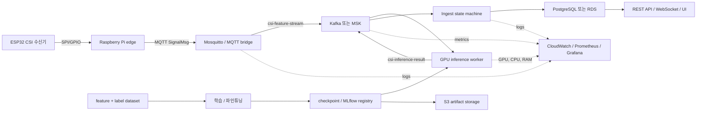

# WIFI-GUARD AWS 일간 비용·파이프라인별 산정 근거

기준일: 2026-09-23
대상 리전: 서울(`ap-northeast-2`)
문서 상태: 계획 추정치(실제 청구서 또는 AWS Pricing Calculator 견적이 아님)

## 1. 한눈에 보는 결과

아래 일간 비용은 월 730시간을 `730 / 24 = 30.4167일`로 나눈 **평균 일간 비용**이다.
실제 달력의 28일·30일·31일 청구액을 뜻하지 않는다. 원화는 실시간 환율이 아니라
`1 USD = 1,400 KRW` 계획 환율이며, 최종 계획값에는 가격·트래픽 불확실성 예비비 15%를
더했다.

| 시나리오 | 기본/일 | 예비비 포함/일 | 계획 원화/일 | 기본/월 | 예비비 포함/월 |
|---|---:|---:|---:|---:|---:|
| Pilot all-in-one | $16.86 | $19.39 | 약 27,140원 | $512.73 | $589.64 |
| Managed baseline | $43.14 | $49.61 | 약 69,455원 | $1,312.17 | $1,509.00 |
| Managed HA | $66.15 | $76.07 | 약 106,497원 | $2,011.97 | $2,313.77 |

현재 단계의 권장 기준안은 **Pilot all-in-one**이다. 1대의 GPU EC2에서 소프트웨어 파이프라인을
운영해 실제 트래픽, Kafka 보존량, 로그량, 모델 호출률을 먼저 계측한다. 다만 이 구성은 단일 장애
지점이고 Kafka·PostgreSQL을 직접 운영해야 한다. 가용성 요구가 생기면 데이터베이스와 Kafka를
각각 RDS와 MSK로 분리하고, 서비스 중단을 허용할 수 없을 때 두 번째 GPU 노드를 추가한다.

## 2. 어떤 파이프라인을 비용으로 바꿨는가



비용 단계와 실제 소프트웨어 경로의 대응은 다음과 같다.

| 비용 단계 | 실제 파이프라인 | Pilot all-in-one | Managed baseline / HA |
|---|---|---|---|
| Edge capture | ESP32 → SPI/GPIO → Raspberry Pi → MQTT | AWS 밖의 기존 장비로 가정, 비용 제외 | 동일 |
| Application compute | Mosquitto, bridge, inference, ingest, API, UI, 학습/파인튜닝, MLflow | GPU EC2 1대와 EBS에 함께 배치 | GPU EC2 1대, HA는 2대 |
| Streaming | `csi-feature-stream`, `csi-inference-result` 전송·보존 | EC2 내부의 self-managed Kafka; 별도 서비스 비용 없음 | MSK Serverless cluster/partition/data/storage |
| Database | fall event, 메타데이터, 서비스 상태 | EC2 내부 PostgreSQL과 EBS | RDS PostgreSQL Single-AZ 또는 Multi-AZ |
| Artifact storage | 데이터셋, 체크포인트, 모델, 백업 | S3 Standard 100 GB | 100 GB 또는 HA 250 GB |
| Observability | 애플리케이션 로그, 자원 모니터링 | CloudWatch 입력 10 GB/월 가정 | 15 GB 또는 HA 50 GB/월 |
| Shared network | 로드밸런서, DNS, 전송, API 요청 | 월 $25 계획 allowance | 월 $50 또는 $100 계획 allowance |

Pilot의 EC2 한 대는 여러 단계를 동시에 실행한다. 따라서 `EC2 $472.31`을 MQTT, Kafka, 추론,
API별로 임의 분할하지 않았다. 그 분할은 실제 컨테이너별 CPU 시간, GPU 시간, 메모리, 네트워크를
장기간 수집해야 의미가 있다. 이 문서는 AWS 청구 단위에는 정확히 연결하되, 아직 실측하지 않은
내부 서비스별 배분은 만들지 않는다.

## 3. 계산 방법

### 3.1 공통 계산식

```text
시간제 리소스 월 비용 = 노드 또는 클러스터 수 × 730시간 × 시간당 단가
저장공간 월 비용      = 할당 GB × GB-month 단가
데이터 처리 월 비용   = 월간 GB × GB당 단가
시나리오 기본 월 비용 = 모든 구성요소 월 비용의 합
예비비 포함 월 비용   = 기본 월 비용 × 1.15
평균 일간 비용        = 월 비용 ÷ (730 ÷ 24)
계획 원화             = USD × 1,400
```

여기서 월 730시간은 AWS 비용 계획에서 흔히 사용하는 연평균 월 시간이다. 따라서 평균 한 달은
30.4167일이며, 일간 값은 비교 편의를 위한 환산치다.

### 3.2 Pilot 계산 예시

```text
GPU EC2       = 1 × 730 × $0.647              = $472.31
EBS gp3       = 100 GB × $0.0912              =   $9.12
S3 Standard   = 100 GB × $0.025               =   $2.50
CloudWatch    = (10 GB - 무료 5 GB) × $0.76   =   $3.80
네트워크 등 계획 allowance                       =  $25.00
기본 월 합계                                      = $512.73
예비비 포함 월 비용 = $512.73 × 1.15            = $589.64
예비비 포함 일 비용 = $589.64 ÷ 30.4167         =  $19.39
계획 원화/일       = $19.39 × 1,400              ≈ 27,140원
```

반올림은 구성요소와 최종 합계에서 센트 단위로 수행하므로 수식을 손으로 재계산하면 $0.01 내외의
차이가 날 수 있다.

### 3.3 인스턴스 선택 근거

개발 PC에서 측정한 짧은 smoke/benchmark 피크에 1.5배 여유를 적용한 시작 envelope는
`3 vCPU / RAM 4 GiB / GPU VRAM 2 GiB / 영구 저장공간 10 GiB`였다. 서울 리전에서 이 범위를
넘고 CUDA 추론을 실행할 수 있는 시작 후보로 `g4dn.xlarge`(4 vCPU, RAM 16 GiB, T4 VRAM
16 GiB)를 선택했다.

이 envelope는 24시간 soak 또는 다중 기기 부하 시험 결과가 아니다. 특히 all-in-one은 추론과
Kafka·PostgreSQL·모니터링을 한 노드에 함께 넣기 때문에 실제 운영 전에는 컨테이너별 장기 피크,
디스크 IOPS, Kafka lag, 추론 latency를 다시 측정해야 한다.

## 4. Pilot all-in-one 상세 내역

구성: GPU EC2 1대 + EBS 100 GB + S3 100 GB. Kafka, PostgreSQL, Mosquitto, 모델 추론,
API, MLflow, 모니터링은 한 EC2에 배치한다. HA는 없다.

| 파이프라인 단계 | AWS 구성요소 | 사용량 가정 | 단가 | 기본/일 | 기본/월 | 월 기본비 비중 |
|---|---|---:|---:|---:|---:|---:|
| Application compute | EC2 g4dn.xlarge On-Demand | 730 instance-hour | $0.647/hour | $15.53 | $472.31 | 92.12% |
| Application compute | EBS gp3 | 100 GB-month | $0.0912/GB-month | $0.30 | $9.12 | 1.78% |
| Artifact storage | S3 Standard | 100 GB-month | $0.025/GB-month | $0.08 | $2.50 | 0.49% |
| Observability | CloudWatch custom logs | 입력 10 GB 중 과금 5 GB | $0.76/GB | $0.12 | $3.80 | 0.74% |
| Shared network | network/LB/DNS/API allowance | 1 planning allowance | $25/month | $0.82 | $25.00 | 4.88% |
| **합계** |  |  |  | **$16.86** | **$512.73** | **100%** |

핵심 원인은 GPU EC2다. 기본 월 비용의 92.12%가 `g4dn.xlarge` 한 대에서 발생한다. 이 시나리오의
Kafka와 PostgreSQL 비용이 0인 것이 아니라 EC2와 EBS 비용 안에 포함된 것이다. 관리형 서비스
요금 대신 장애 대응, 백업, 업그레이드, 용량 관리 책임이 운영팀에 남는다.

## 5. Managed baseline 상세 내역

구성: GPU EC2 1대 + EBS 100 GB + RDS PostgreSQL Single-AZ 100 GB + MSK Serverless
1 cluster/3 partitions + S3 100 GB. 추론 노드는 여전히 단일 장애 지점이다.

| 파이프라인 단계 | AWS 구성요소 | 사용량 가정 | 단가 | 기본/일 | 기본/월 | 월 기본비 비중 |
|---|---|---:|---:|---:|---:|---:|
| Application compute | EC2 g4dn.xlarge On-Demand | 730 instance-hour | $0.647/hour | $15.53 | $472.31 | 35.99% |
| Application compute | EBS gp3 | 100 GB-month | $0.0912/GB-month | $0.30 | $9.12 | 0.70% |
| Database | RDS PostgreSQL db.t4g.medium Single-AZ | 730 instance-hour | $0.102/hour | $2.45 | $74.46 | 5.67% |
| Database | RDS gp3 Single-AZ | 100 GB-month | $0.131/GB-month | $0.43 | $13.10 | 1.00% |
| Artifact storage | S3 Standard | 100 GB-month | $0.025/GB-month | $0.08 | $2.50 | 0.19% |
| Observability | CloudWatch custom logs | 입력 15 GB 중 과금 10 GB | $0.76/GB | $0.25 | $7.60 | 0.58% |
| Streaming | MSK Serverless cluster | 730 cluster-hour | $0.92/hour | $22.08 | $671.60 | 51.18% |
| Streaming | MSK Serverless partitions | 2,190 partition-hour | $0.0018/hour | $0.13 | $3.94 | 0.30% |
| Streaming | MSK data in | 10 GB/month | $0.123/GB | $0.04 | $1.23 | 0.09% |
| Streaming | MSK data out | 10 GB/month | $0.061/GB | $0.02 | $0.61 | 0.05% |
| Streaming | MSK storage | 50 GB-month | $0.114/GB-month | $0.19 | $5.70 | 0.43% |
| Shared network | network/LB/DNS/API allowance | 1 planning allowance | $50/month | $1.64 | $50.00 | 3.81% |
| **합계** |  |  |  | **$43.14** | **$1,312.17** | **100%** |

이 시나리오에서 가장 큰 항목은 MSK Serverless cluster-hour `$671.60/월`이다. 실제 데이터
10 GB를 넣고 10 GB를 꺼내는 비용은 합쳐도 `$1.84/월`이지만, 클러스터가 켜져 있는 시간비는
트래픽이 적어도 계속 발생한다. 그래서 관리형 Kafka의 운영 편의성이 Pilot 대비 월 비용 증가의
주요 원인이다.

단계별로 합치면 Application compute `$481.43/월`, Streaming `$683.08/월`, Database
`$87.56/월`, Artifact storage `$2.50/월`, Observability `$7.60/월`, Shared network
`$50.00/월`이다.

## 6. Managed HA 상세 내역

구성: GPU EC2 2대 + EBS 200 GB + RDS PostgreSQL Multi-AZ 100 GB + MSK Serverless
1 cluster/12 partitions + S3 250 GB. 추론 노드와 데이터베이스 가용성을 높인 계획안이다.

| 파이프라인 단계 | AWS 구성요소 | 사용량 가정 | 단가 | 기본/일 | 기본/월 | 월 기본비 비중 |
|---|---|---:|---:|---:|---:|---:|
| Application compute | EC2 g4dn.xlarge On-Demand | 1,460 instance-hour | $0.647/hour | $31.06 | $944.62 | 46.95% |
| Application compute | EBS gp3 | 200 GB-month | $0.0912/GB-month | $0.60 | $18.24 | 0.91% |
| Database | RDS PostgreSQL db.t4g.medium Multi-AZ | 730 instance-hour | $0.203/hour | $4.87 | $148.19 | 7.37% |
| Database | RDS gp3 Multi-AZ | 100 GB-month | $0.262/GB-month | $0.86 | $26.20 | 1.30% |
| Artifact storage | S3 Standard | 250 GB-month | $0.025/GB-month | $0.21 | $6.25 | 0.31% |
| Observability | CloudWatch custom logs | 입력 50 GB 중 과금 45 GB | $0.76/GB | $1.12 | $34.20 | 1.70% |
| Streaming | MSK Serverless cluster | 730 cluster-hour | $0.92/hour | $22.08 | $671.60 | 33.38% |
| Streaming | MSK Serverless partitions | 8,760 partition-hour | $0.0018/hour | $0.52 | $15.77 | 0.78% |
| Streaming | MSK data in | 100 GB/month | $0.123/GB | $0.40 | $12.30 | 0.61% |
| Streaming | MSK data out | 100 GB/month | $0.061/GB | $0.20 | $6.10 | 0.30% |
| Streaming | MSK storage | 250 GB-month | $0.114/GB-month | $0.94 | $28.50 | 1.42% |
| Shared network | network/LB/DNS/API allowance | 1 planning allowance | $100/month | $3.29 | $100.00 | 4.97% |
| **합계** |  |  |  | **$66.15** | **$2,011.97** | **100%** |

Managed baseline 대비 증가는 주로 두 번째 GPU 노드와 RDS Multi-AZ에서 발생한다. 단계별 월 합계는
Application compute `$962.86`, Streaming `$734.27`, Database `$174.39`, Artifact storage
`$6.25`, Observability `$34.20`, Shared network `$100.00`이다.

이 안을 “완전한 HA”로 단정할 수는 없다. 실제 HA에는 Availability Zone 배치, 로드밸런서 health
check, 세션/캐시 외부화, 모델 아티팩트 배포, 장애 전환 시험, NAT 및 교차 AZ 전송 비용까지
설계해야 한다. 여기서는 그중 큰 고정비를 먼저 보여주는 용량 계획안이다.

## 7. 실제 검증값, 가격표, 가정을 구분하는 방법

| 종류 | 이 문서에서 사용하는 값 | 신뢰 범위 |
|---|---|---|
| 실측 | 짧은 GPU 추론/학습/파인튜닝 profile, 모델 software E2E | 해당 개발 PC의 bounded smoke 결과 |
| 실측 기반 용량 | 1.5배 적용한 3 vCPU / 4 GiB RAM / 2 GiB VRAM / 10 GiB storage | 시작점일 뿐, 운영 보증 아님 |
| 공식 단가 | EC2/EBS, RDS, MSK, S3, CloudWatch Price List | 기준일·서울 리전·선택 SKU에 한함 |
| 사용량 가정 | 월 730시간, 저장 GB, Kafka GB, 로그 GB | 실제 계측 후 교체해야 함 |
| 재무 가정 | 환율 1,400원/USD, 예비비 15% | 의사결정용, 실시간 환율·세금 아님 |
| 계획 allowance | 네트워크/LB/DNS/API 월 $25/$50/$100 | 토폴로지 미확정으로 공식 단가 계산 대신 명시적 가정 |

즉, `$0.647/hour` 같은 값은 AWS 가격표에서 왔고, “GPU 노드 1대를 730시간 가동한다”는 것은
배포 가정이다. 둘을 곱한 `$472.31/월`은 재현 가능한 계산 결과지만 실제 청구액은 운영시간,
리전, 할인, 세금, 송수신량에 따라 달라진다.

## 8. 포함된 비용과 빠진 비용

### 포함

- 24×7 GPU EC2 On-Demand 컴퓨트
- EC2 EBS gp3 할당 용량
- 시나리오별 RDS compute와 gp3 storage
- 시나리오별 MSK Serverless cluster, partition, data in/out, storage
- S3 Standard 모델·데이터 아티팩트 용량
- CloudWatch custom log ingest에서 가정한 5 GB 무료 구간 이후
- 네트워크, 로드밸런서, DNS, API 요청에 대한 명시적 planning allowance
- 최종 계획값의 15% 예비비

### 제외 또는 아직 고정하지 않음

- ESP32, Raspberry Pi, 센서 배선, 현장 전력, 현장 인터넷 회선
- 세금, AWS Business/Enterprise Support, 실제 원·달러 환율 변동
- 구체적인 NAT Gateway 시간·처리량, public egress, inter-AZ 전송
- ALB/NLB 종류와 LCU, Route 53 hosted zone/query, API Gateway 실제 요청 수
- EBS/RDS snapshot, PITR 보존, S3 versioning/lifecycle, Glacier 전환
- KMS, Secrets Manager, WAF, GuardDuty 등 보안 서비스
- 다중 기기 증가에 따른 MQTT/Kafka/DB/추론 부하
- 독립 데이터셋 전체 재학습, 하이퍼파라미터 탐색, 실패한 학습 반복
- 장기 Prometheus 지표 보존과 로그 검색 비용

누락 항목을 0원으로 본 것이 아니다. 현재 토폴로지와 사용량으로 확정할 수 없어 allowance 또는
제외 항목으로 분리했다. AWS 배포 직전에는 NAT, ALB, egress, snapshot, 보안 서비스의 실제 설계를
넣어 다시 계산해야 한다.

## 9. 비용 민감도와 절감 지점

1. **GPU 가동시간**: On-Demand `g4dn.xlarge`는 `$0.647/hour`다. 24×7 실시간 안전 서비스면
   중지 가정을 쓰면 안 되지만, 개발·학습 환경은 스케줄 중지로 거의 가동시간에 비례해 줄일 수 있다.
2. **예약 할인**: 1년 No Upfront 표준 예약형 단가 `$0.407/hour`를 적용하면 GPU compute가
   `$472.31 → $297.11/월`로 `$175.20`, 즉 37.1% 감소한다. 서비스 부하와 계약 조건이 안정된
   뒤에만 적용해야 한다.
3. **별도 학습**: 같은 GPU를 추가로 월 10시간만 쓰는 단순 EC2 추가분은 `$6.47`이다. 데이터
   저장·전송, 오케스트레이션, 준비·실패 시간은 포함하지 않는다.
4. **Kafka 운영 방식**: Managed baseline에서 MSK cluster-hour만 `$671.60/월`이다. 초기 트래픽이
   작다면 self-managed Kafka가 싸지만 운영 부담과 단일 장애 위험을 함께 감수한다.
5. **동시 기기 수**: 현재 단일/제한된 입력으로 검증했다. 기기 수가 늘면 Kafka data, DB write,
   추론 worker 수, 로그량이 함께 증가할 수 있으므로 비용은 선형이라고 단정할 수 없다.
6. **보존 기간**: raw CSI·window·모델 아티팩트를 얼마나 오래 보존할지가 S3, MSK, EBS 비용을
   결정한다. 운영 전 topic retention과 S3 lifecycle을 명시해야 한다.

## 10. 재계산과 감사 추적

단가, 공식 출처 URL, 사용량, 파이프라인 단계, 구성요소별 일간·월간 비용, 비중은 모두
`artifacts/validation/aws-cost-estimate.json`에 기록된다. 다음 명령으로 같은 결과를 재생성한다.

```powershell
py -3 tools/estimate_aws_cost.py `
  --hours-per-month 730 `
  --usd-krw 1400 `
  --contingency-percent 15 `
  --output artifacts/validation/aws-cost-estimate.json
```

예를 들어 12시간/일만 가동하면 `--hours-per-month 365`, 환율을 1,450원으로 보고 싶으면
`--usd-krw 1450`으로 바꿀 수 있다. 단, 저장공간과 월 allowance는 가동시간과 무관하게 그대로
남고, 스크립트의 CloudWatch/MSK 사용량 가정도 자동으로 절반이 되지는 않는다.

## 11. 공식 가격 근거

- [AWS EC2/EBS 서울 리전 Price List](https://pricing.us-east-1.amazonaws.com/offers/v1.0/aws/AmazonEC2/current/ap-northeast-2/index.csv)
- [AWS RDS 서울 리전 Price List](https://pricing.us-east-1.amazonaws.com/offers/v1.0/aws/AmazonRDS/current/ap-northeast-2/index.csv)
- [AWS MSK 서울 리전 Price List](https://pricing.us-east-1.amazonaws.com/offers/v1.0/aws/AmazonMSK/current/ap-northeast-2/index.csv)
- [AWS S3 서울 리전 Price List](https://pricing.us-east-1.amazonaws.com/offers/v1.0/aws/AmazonS3/current/ap-northeast-2/index.csv)
- [AWS CloudWatch 서울 리전 Price List](https://pricing.us-east-1.amazonaws.com/offers/v1.0/aws/AmazonCloudWatch/current/ap-northeast-2/index.csv)
- [AWS Price List Bulk API 사용 설명](https://docs.aws.amazon.com/awsaccountbilling/latest/aboutv2/using-the-aws-price-list-bulk-api-fetching-price-list-files-manually.html)

## 12. 다음 운영 검증에서 반드시 수집할 값

최소 2~4주 Pilot을 실행하며 다음을 일·주 단위로 고정하면 계획 allowance를 실제 비용식으로
대체할 수 있다.

| 계측값 | 비용에 연결되는 항목 | 결정에 미치는 영향 |
|---|---|---|
| GPU 사용률, inference latency, queue lag | EC2 노드 수·가동시간 | 단일 GPU 유지, scale-out, 스케줄 중지 여부 |
| MQTT/Kafka in·out GB와 partition 수 | MSK 또는 self-managed Kafka | 관리형 전환 시점과 retention |
| Kafka lag·disk·IOPS | EBS/MSK storage | 디스크 크기, IOPS, 보존 기간 |
| PostgreSQL CPU·connections·write IOPS·storage | RDS class/storage/IOPS | RDS 크기와 Multi-AZ 필요성 |
| checkpoint/dataset/artifact 증가량 | S3 GB-month와 request | lifecycle, version retention |
| 로그 생성 GB/일과 보존 기간 | CloudWatch ingest/storage/query | 로그 수준과 retention |
| NAT/public/inter-AZ GB | 네트워크 실제 단가 | VPC endpoint, AZ 배치, egress 최적화 |
| 장애·복구 시간과 허용 RTO/RPO | 두 번째 EC2, Multi-AZ, backup | Pilot/Managed/HA 시나리오 선택 |

최종 AWS 예산은 이 실측치를 같은 계산기에 넣고 AWS Pricing Calculator와 월 청구 Cost Explorer로
교차 검증한 뒤 확정해야 한다.
