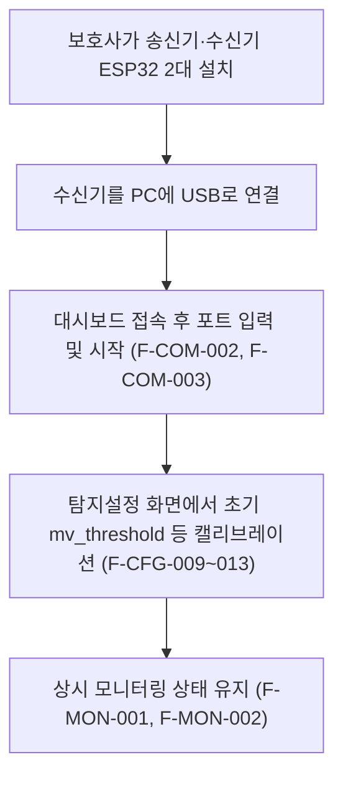
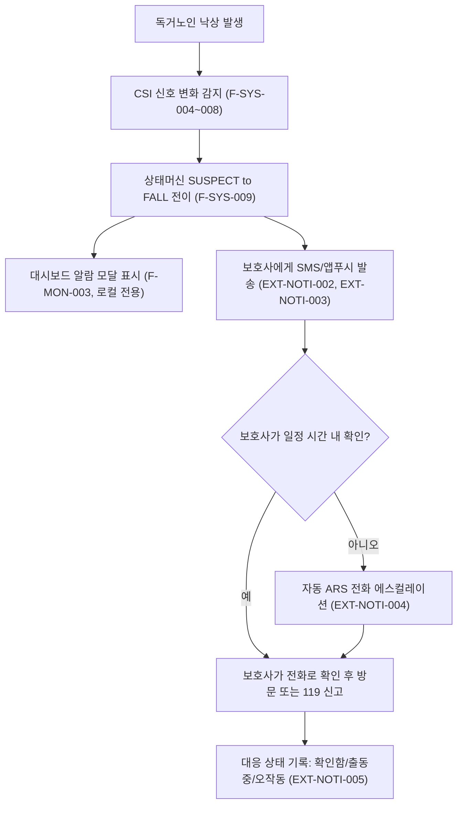
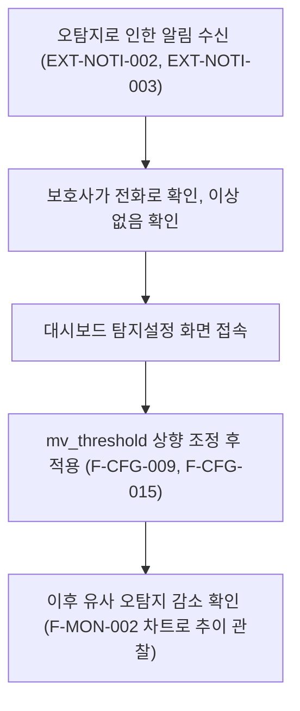
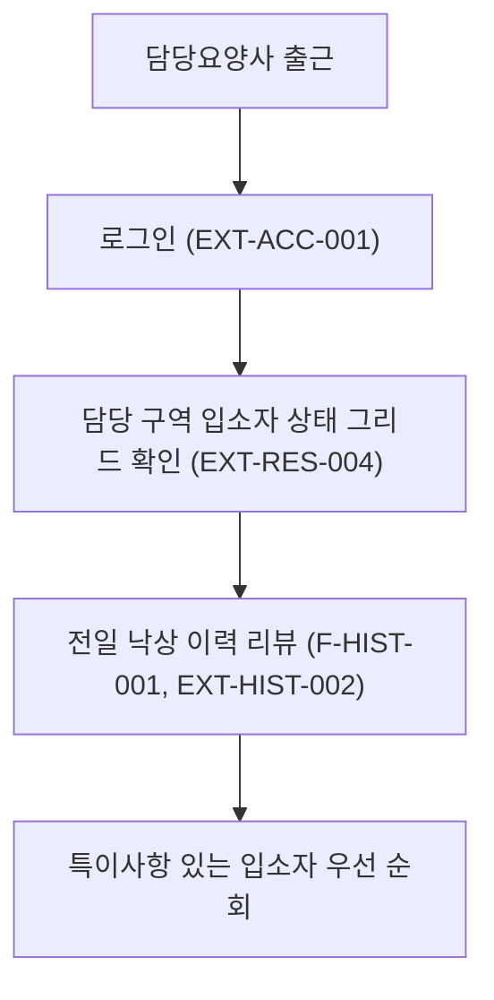
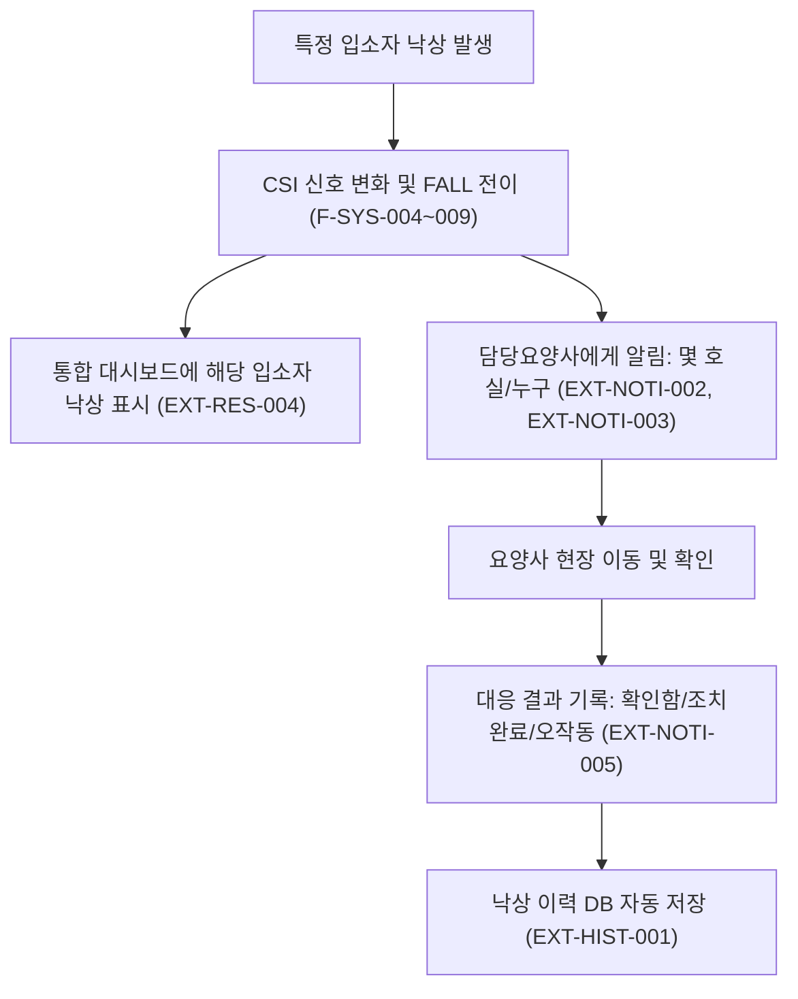
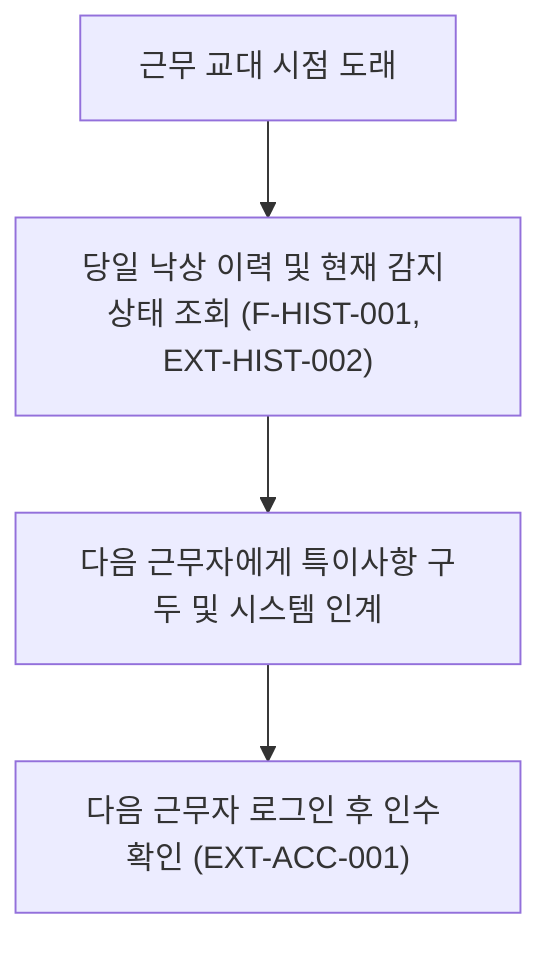

# 낙상 감지 시스템 기능정의서

> **버전**: 1.0 · **작성일**: 2026-07-07
> **대상**: `tools/fall_detect` (MVP v1, commit `9bba36c` 이후 기준)
> **문서 성격**: 화면·기능 단위 기능정의서 + 페르소나별 User Flow. 코드/알고리즘 상세는 [`SPEC.md`](./SPEC.md) 참고.

---

## 1. 개요

### 1.1 목적

이 문서는 두 가지를 정의한다.

1. **① 기존 구현 기능 정의서** — 현재 코드(`main.py`, `src/*.py`, `static/index.html`)에 실제로 구현되어 동작하는 기능을 화면·기능 단위로 표로 정리.
2. **② 확장 제안 기능 정의서** — 아래 두 페르소나의 핵심 니즈를 충족하기 위해 현재 시스템에 **없는** 기능 중, 우선순위가 높은 핵심 격차(core gap)를 정의.

현재 시스템은 낙상을 감지하면 **같은 PC/브라우저 탭을 누군가 계속 보고 있어야만** 인지할 수 있는 구조다(원격 알림·다중 거주자 관리·계정 권한·이력 영속화 없음). 두 페르소나 모두 "보호자/요양사가 낙상을 즉시 인지하고 대응한다"가 핵심 가치이므로, 기존 기능만으로는 실사용 시나리오를 충족하지 못한다. 이에 따라 확장 제안 기능을 별도 표로 함께 정의한다.

### 1.2 페르소나

| 페르소나 | 장소 | 거주자/피관찰자 | 관찰·대응 주체 | 특징 |
|---|---|---|---|---|
| **A. 가정** | 자택 (1인 가구) | 독거노인 (거주자, 비상주 보호자와 별거) | 보호사 (가족 또는 돌봄인, **원격·비상주**) | 감시 대상 1명, 알림 수신자도 소수(1~2명), 보호사는 물리적으로 그 자리에 없음 |
| **B. 요양원** | 요양시설 | 담당노인 (입소자, 다수) | 담당요양사 (**상주**, 여러 입소자 동시 담당) | 감시 대상 다수(N명), 요양사는 시설 내 상주하지만 모든 화면을 동시에 볼 수 없음, 교대근무로 인수인계 필요 |

두 페르소나의 공통 격차: **원격/비동기 알림 부재**. 페르소나 B에는 추가로 **다중 거주자 관리, 계정/권한 분리**가 필요하다.

### 1.3 표기 규칙

- **중요도**: `상`(핵심 가치에 직결, 미구현/미동작 시 시스템 목적 훼손) / `중`(사용성·운영에 중요) / `하`(부가 기능, 없어도 핵심 동작에 지장 없음)
- **기능ID 접두어**:
  - 기존 기능: `F-COM`(공통/사이드바) · `F-MON`(모니터링) · `F-CFG`(탐지설정) · `F-HIST`(낙상기록) · `F-TRN`(Train) · `F-SYS`(백엔드/시스템, 전용 화면 없음)
  - 확장 제안 기능: `EXT-NOTI`(알림) · `EXT-RES`(거주자/디바이스 관리) · `EXT-ACC`(계정/권한) · `EXT-HIST`(이력 영속화)
- 표의 근거는 실제 코드 라인 기준이며, 문서-코드 불일치가 확인된 항목은 기능설명에 **⚠**로 표시하고 [6장](#6-부록-문서-코드-불일치-참고사항)에 상세를 정리했다.

---

## 2. 기능정의서 ① — 기존 구현 기능

### 2.1 공통 (사이드바) — 모든 화면에 상시 노출

| 기능ID | 화면 | Category | Depth1 | Depth2 | 중요도 | 기능설명 및 목적 |
|---|---|---|---|---|---|---|
| F-COM-001 | 공통(사이드바) | 실시간모니터링 | 연결 상태 표시 | 상태 표시등(dot)+텍스트 | 상 | 시리얼 모니터링 실행 여부를 녹색/빨간 점과 "실행중"/"중지됨" 텍스트로 즉시 인지. WS 메시지의 `running` 값이 매 100ms마다 갱신. |
| F-COM-002 | 공통(사이드바) | 데이터수집 | ESP32 연결 제어 | 포트 입력 필드 | 상 | 사용자가 수신용 ESP32의 시리얼 포트명(예: COM3)을 직접 입력. 실행 중에는 비활성화되어 실수 변경 방지. |
| F-COM-003 | 공통(사이드바) | 데이터수집 | ESP32 연결 제어 | 시작/중지 토글 버튼 | 상 | `POST /monitor/start` · `/monitor/stop` 호출로 CSI 수집 스레드 및 시리얼 포트를 열고 닫음. |
| F-COM-004 | 공통(사이드바) | 낙상감지 | 낙상 상태 요약 | 낙상 상태 배지 | 상 | 대기(회색)/의심(주황)/낙상(빨강)/냉각중(파랑) 4색 배지로 현재 상태머신 상태를 항상 노출. |
| F-COM-005 | 공통(사이드바) | 낙상감지 | 낙상 상태 요약 | 마지막 낙상 시각 표시 | 중 | 가장 최근 `last_fall_at`(ISO8601)을 표시, 없으면 "감지되지 않음". |
| F-COM-006 | 공통(사이드바) | 실시간모니터링 | 화면 내비게이션 | 4탭 전환(모니터링/탐지설정/낙상기록/Train) + 정지 버튼 | 중 | 사이드바 내비게이션 그리드로 화면 전환. URL 라우팅은 없고 새로고침 시 항상 모니터링 탭으로 초기화됨. |
| F-COM-007 | 공통(사이드바) | 시스템관리 | 이벤트 로그 | 롤링 이벤트 로그(최대 80줄) | 중 | 시작/중지/에러/설정적용/낙상감지 이벤트를 타임스탬프와 함께 스크롤 로그로 기록. 클라이언트 메모리 전용. |

### 2.2 모니터링 화면 (`#page-monitor`, 기본 화면)

| 기능ID | 화면 | Category | Depth1 | Depth2 | 중요도 | 기능설명 및 목적 |
|---|---|---|---|---|---|---|
| F-MON-001 | 모니터링 | 실시간모니터링 | 감지 상태 요약 | 상태/MV값/신뢰도/임계값 스탯카드 | 상 | 현재 상태(한글 번역), `mv_current`, `confidence×100`, `mv_threshold`를 4개 카드로 10Hz 갱신. |
| F-MON-002 | 모니터링 | 실시간모니터링 | 이동분산 시각화 | 이동분산 라인차트(최근 240틱=24초) | 상 | 5-샘플 평활된 MV값(파란선)과 임계값 기준선(주황선)을 canvas로 실시간 비교 제공, 임계값 캘리브레이션의 근거 화면. |
| F-MON-003 | 모니터링 | 알림 | 낙상 알람 | 전면 알람 모달(5초 자동닫힘) | 상 | `just_triggered=true` 감지 즉시 화면 전체를 덮는 경고 팝업 표시. ⚠ 소리·OS 푸시·탭 밖 알림은 없음 — 해당 브라우저 탭을 보고 있어야만 인지 가능([6.4](#64-알림-관련-제약)). |

### 2.3 탐지설정 화면 (`#page-config`) — `PipelineConfig` 13개 파라미터 1:1 매핑

**Depth1: 신호처리 파이프라인 파라미터**

| 기능ID | 화면 | Category | Depth1 | Depth2 | 중요도 | 기능설명 및 목적 |
|---|---|---|---|---|---|---|
| F-CFG-001 | 탐지설정 | 설정관리 | 신호처리 파이프라인 파라미터 | `window_sec` (CSI 슬라이딩 윈도우, 기본 3.0초) | 중 | 매 tick마다 분석할 CSI 데이터의 시간 길이 조정 |
| F-CFG-002 | 탐지설정 | 설정관리 | 신호처리 파이프라인 파라미터 | `stride_sec` (파이프라인 실행 주기, 기본 0.5초) | 중 | 감지 결과 갱신 빈도 조정 |
| F-CFG-003 | 탐지설정 | 설정관리 | 신호처리 파이프라인 파라미터 | `fs_hz` (리샘플링 목표 주파수, 기본 100Hz) | 하 | 불규칙 수신 간격을 정규 그리드로 리샘플링할 목표 속도 |
| F-CFG-004 | 탐지설정 | 설정관리 | 신호처리 파이프라인 파라미터 | `mv_window_sec` (이동분산 윈도우, 기본 0.5초) | 중 | 움직임 강도를 계산하는 시간 윈도우 폭 조정 |
| F-CFG-005 | 탐지설정 | 설정관리 | 신호처리 파이프라인 파라미터 | `n_streams` (선택 부반송파 수, 기본 10) | 하 | q-value 상위 몇 개 부반송파를 합산에 사용할지 조정 |
| F-CFG-006 | 탐지설정 | 설정관리 | 신호처리 파이프라인 파라미터 | `bandpass_low` (대역통과 하한, 기본 2.0Hz) | 하 | 낙상 특성 주파수 대역 하한 조정 |
| F-CFG-007 | 탐지설정 | 설정관리 | 신호처리 파이프라인 파라미터 | `bandpass_high` (대역통과 상한, 기본 50.0Hz) | 하 | 대역 상한 조정. ⚠ Nyquist(`fs_hz/2`) 초과 입력 시 자동으로 `fs_hz/2 - 1.0`으로 강등됨(UI에 안내 없음) |
| F-CFG-008 | 탐지설정 | 설정관리 | 신호처리 파이프라인 파라미터 | `bandpass_order` (필터 차수, 기본 4) | 하 | Butterworth 필터의 급준도 조정 |

**Depth1: 상태머신 파라미터**

| 기능ID | 화면 | Category | Depth1 | Depth2 | 중요도 | 기능설명 및 목적 |
|---|---|---|---|---|---|---|
| F-CFG-009 | 탐지설정 | 설정관리 | 상태머신 파라미터 | `mv_threshold` (낙상 판정 임계값, 기본 **2.5**) | 상 | 오감지·미감지 균형을 맞추는 핵심 튜닝값. ⚠ README/API.md는 기본값 1.0으로 문서화되어 있으나 실제 코드 기본값은 2.5([6.1](#61-문서-코드-불일치)) |
| F-CFG-010 | 탐지설정 | 설정관리 | 상태머신 파라미터 | `min_duration_s` (낙상 확정 최소 지속시간, 기본 0.5초) | 상 | 순간 스파이크에 의한 오감지를 방지하는 디바운스 시간 |
| F-CFG-011 | 탐지설정 | 설정관리 | 상태머신 파라미터 | `merge_gap_s` (SUSPECT 병합 갭, 기본 0.25초) | 중 | 임계값 아래로 짧게 떨어졌다 올라오는 신호를 하나의 이벤트로 병합(히스테리시스) |
| F-CFG-012 | 탐지설정 | 설정관리 | 상태머신 파라미터 | `max_duration_s` (낙상 최대 지속시간, 기본 2.0초) | 중 | FALL 상태가 무한정 지속되지 않도록 강제 COOLDOWN 전이 |
| F-CFG-013 | 탐지설정 | 설정관리 | 상태머신 파라미터 | `cooldown_s` (재감지 lockout, 기본 3.0초) | 중 | 낙상 감지 직후 중복/연쇄 알림을 방지하는 대기시간 |

**Depth1: 설정값 동기화**

| 기능ID | 화면 | Category | Depth1 | Depth2 | 중요도 | 기능설명 및 목적 |
|---|---|---|---|---|---|---|
| F-CFG-014 | 탐지설정 | 설정관리 | 설정값 동기화 | 설정 자동 로드(`GET /detection/config`) | 중 | 화면 진입 시 서버의 현재 확정값을 폼에 자동 반영 |
| F-CFG-015 | 탐지설정 | 설정관리 | 설정값 동기화 | 설정 적용(`POST /detection/config`, 부분 업데이트) | 상 | 재시작 없이 다음 tick부터 즉시 반영. 비어있지 않은 필드만 전송. ⚠ 적용 후 "3초 자동소실 토스트"가 문서화되어 있으나 실제로는 이벤트 로그에 한 줄 기록될 뿐 별도 토스트 UI는 없음 |

### 2.4 낙상기록 화면 (`#page-history`)

| 기능ID | 화면 | Category | Depth1 | Depth2 | 중요도 | 기능설명 및 목적 |
|---|---|---|---|---|---|---|
| F-HIST-001 | 낙상기록 | 이력관리 | 낙상 이력 조회 | 낙상 이력 테이블(시각/신뢰도) | 중 | 현재 브라우저 세션 중 감지된 낙상을 시간 역순 목록으로 표시(최대 100건). ⚠ 클라이언트 메모리 전용 — 서버 저장이 없어 새로고침·재접속 시 전체 소실. 인수인계·장기 추이 분석 불가 |

### 2.5 Train 화면 (`#page-train`)

| 기능ID | 화면 | Category | Depth1 | Depth2 | 중요도 | 기능설명 및 목적 |
|---|---|---|---|---|---|---|
| F-TRN-001 | Train | 시스템관리 | (예정) 개인화 모델 학습 | 안내 문구 placeholder | 하 | "DNN 모델 학습 기능은 추후 제공될 예정입니다" 정적 텍스트만 존재. 실제 학습 로직·버튼·API 연동 없음(순수 스텁) |

### 2.6 시스템 (백엔드, 전용 화면 없음)

| 기능ID | 화면 | Category | Depth1 | Depth2 | 중요도 | 기능설명 및 목적 |
|---|---|---|---|---|---|---|
| F-SYS-001 | 시스템(백엔드) | 데이터수집 | CSI 프레임 수집 | 바이너리 프레임 파싱 및 체크섬 검증 | 상 | ESP32 수신기가 보내는 `0xA55A` 매직·612바이트 CSI 페이로드 프레임을 파싱하고 체크섬으로 무결성 검증 |
| F-SYS-002 | 시스템(백엔드) | 데이터수집 | CSI 프레임 수집 | 32비트 타임스탬프 언랩 | 중 | ESP32 로컬 타임스탬프(μs, 약 71.6분마다 wrap)의 오버플로우를 보정해 시계열 정합성 유지 |
| F-SYS-003 | 시스템(백엔드) | 데이터수집 | CSI 프레임 수집 | Ring buffer 관리(최대 1500프레임 ≈15초) | 중 | 최근 CSI 데이터를 메모리에 유지해 파이프라인에 트레일링 윈도우 공급 |
| F-SYS-004 | 시스템(백엔드) | 신호처리 | 신호처리 파이프라인 | 리샘플링(불규칙 간격→100Hz 정규 그리드) | 상 | 선형보간으로 시간축을 정규화해 이후 필터링이 안정적으로 동작하도록 함 |
| F-SYS-005 | 시스템(백엔드) | 신호처리 | 신호처리 파이프라인 | 대역통과 필터(Butterworth, 2~50Hz, zero-phase) | 상 | 낙상 운동의 특성 주파수 대역만 추출하고 고주파 노이즈 제거 |
| F-SYS-006 | 시스템(백엔드) | 신호처리 | 신호처리 파이프라인 | 부반송파 선택(q-value 상위 10개) | 상 | 306개 부반송파 중 활동성 높은 채널만 선별해 신호대잡음비 향상 |
| F-SYS-007 | 시스템(백엔드) | 신호처리 | 신호처리 파이프라인 | 합산 및 Z-score 정규화 | 중 | 선택된 부반송파를 합산·표준화해 임계값과 비교 가능한 단일 지표 생성 |
| F-SYS-008 | 시스템(백엔드) | 신호처리 | 신호처리 파이프라인 | 이동분산(Moving Variance) 계산 | 상 | 움직임 강도를 정량화하는 핵심 지표(`mv_current`) 산출 |
| F-SYS-009 | 시스템(백엔드) | 낙상감지 | 상태머신 | IDLE→SUSPECT→FALL→COOLDOWN 전이 로직 | 상 | 임계값·지속시간 기반으로 낙상 여부를 판정하고 히스테리시스·재감지 방지를 처리하는 시스템의 핵심 로직 |
| F-SYS-010 | 시스템(백엔드) | 낙상감지 | 상태머신 | Confidence 산출(`mv_current/mv_threshold`) | 중 | 임계값 대비 초과 비율로 감지 신뢰도를 계산해 UI에 %로 노출 |
| F-SYS-011 | 시스템(백엔드) | 실시간모니터링 | 데이터 전송 | WebSocket(`/ws/live`) 10Hz 푸시 | 상 | 감지 결과를 100ms 간격으로 프런트엔드에 실시간 전송하는 핵심 통신 채널 |
| F-SYS-012 | 시스템(백엔드) | 실시간모니터링 | 데이터 전송 | REST 스냅샷/상태 조회(`/monitor/status`, `/monitor/snapshot`) | 중 | WS 연결 전/대체용 폴링 API 제공 |
| F-SYS-013 | 시스템(백엔드) | 시스템관리 | 진단 로깅 | 수신 통계 로그(bytes/frames/reject, 10초 주기) | 하 | 서버 콘솔에 진단 정보를 남겨 "packet_count=0" 등 연결 문제 트러블슈팅 지원. API로 노출되지는 않음(로그 전용) |

---

## 3. 기능정의서 ② — 확장 제안 기능 (핵심 격차 위주)

> 아래 기능은 **현재 코드에 존재하지 않는** 제안 사항이다. 두 페르소나의 실사용을 위한 최소 요구사항만 선별했으며(핵심 격차 위주), 웨어러블/카메라 연동, 통계 리포트 등 폭넓은 고도화는 범위에서 제외했다.

### 3.1 알림 — 페르소나 A·B 공통 핵심 격차

> 현재 시스템은 낙상 발생 시 로컬 브라우저 탭에만 팝업을 띄운다(F-MON-003). 보호사·요양사가 그 화면을 보고 있지 않으면 낙상을 알 방법이 전혀 없다 — 두 페르소나 모두에게 가장 치명적인 격차.

| 기능ID | 화면 | Category | Depth1 | Depth2 | 중요도 | 기능설명 및 목적 |
|---|---|---|---|---|---|---|
| EXT-NOTI-001 | (신규) 알림설정 | 알림 | 알림채널 관리 | 알림 수신자(보호자/요양사) 등록·관리 | 상 | 거주자별로 낙상 알림을 받을 연락처(전화번호, 앱 계정 등)를 등록·관리 |
| EXT-NOTI-002 | (신규) 알림설정 | 알림 | 알림채널 관리 | SMS 알림 발송 | 상 | 낙상 감지(`just_triggered`) 즉시 등록된 수신자에게 문자메시지로 원격 통보 |
| EXT-NOTI-003 | (신규) 알림설정 | 알림 | 알림채널 관리 | 앱/웹 푸시 알림 | 상 | 모바일 앱 또는 웹푸시로 통보해, 브라우저 대시보드를 보고 있지 않아도 즉시 인지 가능하도록 함 |
| EXT-NOTI-004 | (신규) 알림설정 | 알림 | 알림채널 관리 | 미확인 시 자동 전화(ARS) 에스컬레이션 | 중 | SMS/푸시가 일정 시간 내 미확인되면 음성 통화로 자동 재통보해 알림 누락을 방지 |
| EXT-NOTI-005 | (신규) 알림설정 | 알림 | 대응 처리 | 알림 확인/대응 상태 기록 | 중 | 수신자가 "확인함/출동중/오작동" 등으로 응답해 대응 이력을 남기고, 낙상기록 화면과 연동 |

### 3.2 거주자/디바이스 관리 — 페르소나 B(요양원) 핵심 격차

> 현재 `EspMonitor`는 전역 싱글턴으로 **단일 ESP32 수신기·단일 거주자만** 지원한다(`static/index.html` 주석: `// Global state (single monitor, no multi-ESP)`). 다수 입소자를 담당하는 요양원 구조에서는 필수 확장.

| 기능ID | 화면 | Category | Depth1 | Depth2 | 중요도 | 기능설명 및 목적 |
|---|---|---|---|---|---|---|
| EXT-RES-001 | (신규) 거주자관리 | 거주자관리 | 거주자 프로필 | 거주자(입소자) 등록/수정 | 상 | 이름, 방 번호, 담당 요양사 등 기본 정보를 관리 |
| EXT-RES-002 | (신규) 거주자관리 | 거주자관리 | 거주자 프로필 | 거주자-ESP32 디바이스 매핑 | 상 | 여러 대의 수신 보드를 거주자별로 식별·연결해 "몇 호실에서 낙상이 발생했는지" 특정 가능하게 함 |
| EXT-RES-003 | (신규) 거주자관리 | 거주자관리 | 거주자 프로필 | 거주자별 감지 파라미터 개별 설정 | 중 | 체형·활동 패턴이 다른 거주자마다 `mv_threshold` 등을 개별 조정해 오감지/미감지 최소화 |
| EXT-RES-004 | (신규) 통합대시보드 | 실시간모니터링 | 다중 거주자 모니터링 | 다중 거주자 상태 그리드 뷰 | 상 | 한 화면에서 여러 거주자의 낙상 상태를 동시에 파악(요양사 1인이 다수 담당 시 필수) |

### 3.3 사용자 계정/권한 — 현재 인증 전무

> `API.md`에 "No authentication required (local development MVP)"로 명시되어 있듯, 현재는 로그인·권한 구분이 전혀 없다. 다중 거주자·다중 담당자 구조가 되면 접근 범위 통제가 필요하다.

| 기능ID | 화면 | Category | Depth1 | Depth2 | 중요도 | 기능설명 및 목적 |
|---|---|---|---|---|---|---|
| EXT-ACC-001 | (신규) 로그인 | 사용자관리 | 인증 | 로그인/로그아웃 | 상 | 시스템 접근을 인증된 사용자(보호사/요양사/관리자)로 제한 |
| EXT-ACC-002 | (신규) 로그인 | 사용자관리 | 권한관리 | 역할 기반 접근 제어(관리자/요양사/보호자) | 상 | 역할에 따라 조회·설정 변경 권한 범위를 다르게 부여(예: 보호자는 설정 변경 불가, 조회만 가능) |
| EXT-ACC-003 | (신규) 로그인 | 사용자관리 | 권한관리 | 담당 거주자 범위 제한 조회 | 중 | 보호자/요양사는 본인이 담당하는 거주자 정보만 조회 가능하도록 제한(개인정보 보호) |

### 3.4 낙상기록 영속화 — 현재 서버·클라이언트 모두 메모리 전용

| 기능ID | 화면 | Category | Depth1 | Depth2 | 중요도 | 기능설명 및 목적 |
|---|---|---|---|---|---|---|
| EXT-HIST-001 | 낙상기록 | 이력관리 | 이력 영속화 | 낙상 이벤트 DB 저장 | 상 | 타임스탬프·신뢰도·지속시간·거주자ID를 서버 DB에 영구 저장해 새로고침·재시작에도 소실되지 않도록 함 |
| EXT-HIST-002 | 낙상기록 | 이력관리 | 이력 영속화 | 기간/거주자별 이력 조회 API | 중 | 장기 추이 분석과 교대 인수인계를 위한 조건별(날짜, 거주자) 조회 |
| EXT-HIST-003 | 낙상기록 | 이력관리 | 이력 영속화 | 이력 내보내기(CSV) | 하 | 병원 진료 참고, 보고 자료 등 외부 활용을 위한 다운로드 |

---

## 4. 사용 시나리오별 User Flow

### 4.1 페르소나 A (가정) — 독거노인 · 보호사

#### Flow A-1: 초기 설치 및 상시 모니터링 시작

#### Flow A-2 (핵심): 낙상 발생 → 원격 알림 대응

#### Flow A-3: 오탐지 처리 및 임계값 조정

### 4.2 페르소나 B (요양원) — 담당노인 · 담당요양사

#### Flow B-1: 교대 시작 및 통합 모니터링

#### Flow B-2 (핵심): 낙상 발생 → 현장 대응

#### Flow B-3: 교대 인수인계

---

## 5. 표 요약

| 구분 | 표 | 행 수 |
|---|---|---|
| 기존 구현 기능 | 공통·모니터링·탐지설정·낙상기록·Train·시스템 | 40 |
| 확장 제안 기능 | 알림·거주자관리·계정권한·이력영속화 | 15 |

---

## 6. 부록: 문서-코드 불일치 참고사항

`SPEC.md`(§12) 및 이번 코드 재검증을 통해 확인된 항목. 기능정의서 작성 시 코드 기준(실제 동작)으로 기재했다.

### 6.1 문서-코드 불일치

| 항목 | 문서(README/API.md) | 실제 코드 | 영향 |
|---|---|---|---|
| `mv_threshold` 기본값 | 1.0 | **2.5** | 감지 민감도가 문서 예상보다 낮음(둔감) |
| 설정 적용 후 토스트 | "3초 자동소실 메시지" 표시 | 이벤트 로그에 한 줄 기록만 존재, 별도 토스트 UI 없음 | 사소한 UX 문서 오차 |
| WS 재연결 경고 | "3회 이상 실패 시 경고 표시" | 카운터/경고 없이 1.5초마다 무한 재시도(조용히) | 연결 장애를 사용자가 인지하기 어려움 |

### 6.2 문서상 계획되었으나 미구현인 항목

| 항목 | 현재 상태 |
|---|---|
| CSI 진폭 히트맵 | `DetectionInfo`에 데이터 필드조차 없음(완전 미구현) |
| 신뢰도 바 위젯 | 스탯카드에 %텍스트만 존재, 프로그레스바 없음 |
| 신호 품질(PPS/gap) 위젯 | WS로 데이터는 전송되나(`quality.*`) 화면에 렌더링되지 않음 |
| `selection`/`final_signal`/`pipeline_latency_ms` | WS 페이로드에 포함되나 UI에서 전혀 사용되지 않음 |

### 6.3 packet_count 미표시

WS 메시지의 `packet_count`는 클라이언트 JS 변수에 저장되지만(`monitor.packetCount`) 화면 어디에도 표시되지 않는다.

### 6.4 알림 관련 제약

낙상 알람은 순수 인앱(in-tab) 시각 알림이다 — 소리, 브라우저 `Notification` API, 진동 없음. 탭이 백그라운드/최소화 상태여도 OS 레벨 알림이 뜨지 않는다. 이는 [3.1 알림](#31-알림--페르소나-ab-공통-핵심-격차) 확장 제안의 핵심 근거다.
