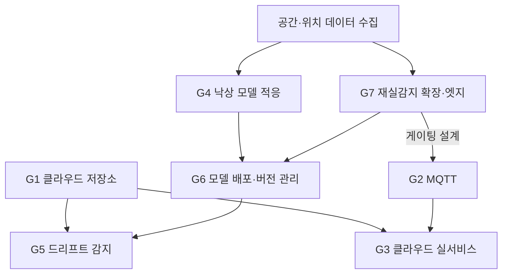

# CSI-Guard 완성 목표 실행 계획

**목표별 수행 과정 · 필요 리소스 · 기술 스택**

작성일 2026-07-29 · v1.1
전제 문서: `CSI-Guard_구현현황_및_완성목표_v1.0_20260729.md`

---

## 0. 문서 목적과 읽는 법

`구현현황_및_완성목표` 문서가 정의한 7개 목표(G1~G7)에 대해, **무엇을 어떤 순서로 해야 하는지(과정)**, **사람·시간·장비가 얼마나 드는지(리소스)**, **어떤 라이브러리·프레임워크·오픈소스 서비스를 쓸 것인지(기술 스택)**를 정리한다.

> **공수 추정에 대한 전제**: 아래 기간은 **해당 작업에 전념하는 인원 1명 기준의 실작업 소요**로 환산한 값이다. 팀 규모·병행 업무·하드웨어 조달 리드타임은 반영하지 않았으므로, 실제 일정 수립 시에는 팀 상황에 맞춰 재환산해야 한다. 데이터 수집이 필요한 G4·G7은 편차가 가장 크다.

| ID  | 목표                                            | 축     | 실행 위치            |
| --- | ----------------------------------------------- | ------ | -------------------- |
| G1  | 클라우드 영속 저장소, 이벤트·응답 이력 보존     | 인프라 | 클라우드             |
| G2  | MQTT 기반 다기기 통합 관리                      | 인프라 | 엣지 ↔ 클라우드      |
| G3  | 다기기·다입소자 클라우드 실서비스 아키텍처      | 인프라 | 클라우드             |
| G4  | 낙상 모델 공간 적응(Few-shot / Online learning) | MLOps  | 클라우드             |
| G5  | 드리프트 감지 자동화                            | MLOps  | 클라우드             |
| G6  | 모델 배포·버전 관리                             | MLOps  | 클라우드 → 엣지 배포 |
| G7  | 재실감지 공간 확장·강건화·엣지 이관             | MLOps  | 엣지                 |

### 0.0 확정된 물리 구성

```
ESP32-C5 송신기 --ESP-NOW(5GHz)--> ESP32-C5 수신기 --USB 시리얼--> 라즈베리파이
라즈베리파이 --2.4GHz Wi-Fi--> 가정용 공유기 --MQTT/TLS--> 클라우드
```

이 구성이 확정되면서 계획 전반이 단순해진 지점이 세 곳 있다.

1. **수신기 펌웨어를 바꾸지 않아도 된다.** MQTT 클라이언트는 라즈베리파이에만 두면 되므로, G2에서 예상했던 펌웨어 팀 의존이 사라진다.
2. **현행 `backend/` 코드를 거의 그대로 이식할 수 있다.** pyserial·numpy·scipy·numba 모두 라즈베리파이에서 동작하며, 시리얼 수집·링버퍼·재실 신호처리 경로를 재작성할 필요가 없다.
3. **감지 링크(5GHz)와 업링크(2.4GHz)의 대역이 분리된다.** 업링크 트래픽이 늘어도 CSI 측정 채널을 오염시키지 않는다. 다만 두 장치를 붙여 두므로 **근접 배치에서 2.4GHz 송신이 5GHz 수신에 미치는 영향은 실측 항목**으로 남는다.

네트워크 측면에서는 가정 공유기 뒤 NAT에서 **아웃바운드 MQTT over TLS(8883)만** 사용하므로 포트포워딩·고정 IP가 필요 없다.

### 0.1 전제 변경: 로컬 우선 → 엣지/클라우드 분리

기존 문서(공모전 보고서 §5.4, 논문 초록)는 **"클라우드 없이 로컬에서 완결"**을 차별점으로 서술해 왔다. 이번 계획은 백엔드 서버·낙상 모델 서빙·저장소를 **클라우드로 올리는 것**을 전제하므로, 그 서술은 더 이상 유효하지 않다. 확정 시 함께 개정해야 하며, 대신 아래 두 가지가 새 방어선이 된다.

1. **재실감지는 엣지에 남긴다**(G7) — 상시 신호가 네트워크에 의존하지 않는다.
2. **엣지 게이팅** — 활동이 감지된 구간만 클라우드로 올려, 원시 CSI 상시 업로드를 피한다.

프라이버시 관점에서는 "데이터가 나가지 않는다"가 아니라 **"필요한 구간만, 암호화해서, 규정된 리전에"**로 논지를 바꿔야 한다. 개인정보 처리방침·저장 위치·보존 기간은 별도 검토 항목이다.

---

## 1. 현재 스택에서 출발점 확인

새로 도입할 것을 정하기 전에, **이미 있는 것**을 기준선으로 둔다.

| 계층        | 현재 사용 중                                                                | 비고                                                                                                   |
| ----------- | --------------------------------------------------------------------------- | ------------------------------------------------------------------------------------------------------ |
| 백엔드      | FastAPI, uvicorn, pyserial, numpy, scipy, torch, numba, ssqueezepy          | `backend/requirements.txt` 8개가 전부                                                                  |
| 프런트엔드  | TanStack Start(React 19), TanStack Router, Tailwind v4, shadcn/ui, Recharts | 패키지 매니저 bun                                                                                      |
| 데이터 계층 | **없음**                                                                    | `@tanstack/react-query`는 설치·Provider 연결까지만 되어 있고 실제 fetch 없음 → G1에서 그대로 활용 가능 |
| 테스트      | **없음**                                                                    | 프런트·백엔드 모두 러너 미설정                                                                         |
| 컨테이너/CI | **없음**                                                                    | 로컬 실행만                                                                                            |
| 클라우드    | **없음**                                                                    | 계정·리전·비용 정책부터 정해야 함                                                                      |

**즉시 활용 가능한 자산**: 이미 설치된 TanStack Query, 이미 정의된 REST 19종 + WS 1종 API 계약, 설계 완료된 후보 ERD. 이 셋이 G1의 착수 비용을 크게 낮춘다.

> `bunfig.toml`에 24시간 공급망 가드(`minimumReleaseAge`)가 걸려 있어, 프런트엔드 신규 패키지는 릴리스 후 24시간이 지나야 설치된다. 긴급 도입이 필요하면 예외 목록 추가에 대한 별도 합의가 필요하다.

---

## 2. G1 — 클라우드 영속 저장소 도입

### 2.1 수행 과정

1. **클라우드 사업자·리전 결정**: 국내 사용자 대상이라면 국내 리전 우선. 이 결정이 이후 모든 관리형 서비스 선택을 구속한다.
2. **ERD 확정**: 설계 완료된 후보 ERD를 현행 도메인 모델(`UserAccount`/`Facility`/`Device`/`Resident`/이벤트 로그)과 대조해 확정한다. 특히 `Resident.deviceIds` 다대다 매핑과 시설 스코핑(`facilityId`)이 스키마에 반영되어야 한다.
3. **시계열 분리**: 이벤트·응답 이력(저빈도, 관계형)과 재실/움직임 지표(고빈도)는 성격이 달라 테이블·보존 정책을 분리한다. 후자는 다운샘플링·자동 만료(retention)를 건다.
4. **저장 계층 이원화**: 관계형 데이터는 관리형 DB, 모델 아티팩트·업로드된 CSI 윈도우는 오브젝트 스토리지.
5. **백엔드 영속 계층 추가**: 현재 메모리 상태를 읽는 지점에 리포지토리 계층을 끼우고, 스키마 변경은 마이그레이션 도구로 버전 관리한다.
6. **프런트엔드 전환**: 인메모리 `mock-store` 읽기를 TanStack Query 훅으로 교체한다. FACILITY 시뮬레이션은 개발용 폴백으로 남기되 실데이터 경로와 분기한다.
7. **엣지 버퍼링 설계**: 네트워크 단절 시 엣지가 이력을 로컬에 임시 저장하고 복구 시 업로드하는 경로를 둔다. 클라우드 전환의 필수 보완책이다.

### 2.2 기술 스택

| 용도               | 선택                                           | 이유 / 대안                                                                  |
| ------------------ | ---------------------------------------------- | ---------------------------------------------------------------------------- |
| 관계형 DB          | **관리형 PostgreSQL**(AWS RDS / GCP Cloud SQL) | 시설·입소자·권한 모델에 적합. 서버리스형 대안: Neon, Supabase                |
| 시계열             | **TimescaleDB**(RDS 확장 또는 Timescale Cloud) | 고빈도 지표 압축·자동 retention. 대안: InfluxDB — 스택이 하나 더 늘어 비권장 |
| 오브젝트 스토리지  | **S3 / GCS**                                   | 모델 아티팩트·CSI 윈도우 보관                                                |
| ORM / 쿼리         | **SQLAlchemy 2.x**                             | 로컬 개발용 SQLite와 운영 PostgreSQL을 같은 코드로 흡수                      |
| 마이그레이션       | **Alembic**                                    | SQLAlchemy 표준 짝                                                           |
| 스키마 검증        | **Pydantic v2**                                | FastAPI에 이미 포함                                                          |
| 엣지 로컬 버퍼     | **SQLite**                                     | 단절 구간 임시 저장                                                          |
| 프런트 데이터 계층 | **@tanstack/react-query**                      | 이미 설치·Provider 연결 완료, 실사용만 남음                                  |

### 2.3 리소스

- **인력**: 백엔드 1명(주), 프런트엔드 1명(전환 작업)
- **기간**: 백엔드 3~4주(클라우드 셋업 포함) + 프런트 전환 1~2주
- **인프라 비용**: 파일럿 기준 관리형 DB 소형 인스턴스 + 오브젝트 스토리지. **월 고정비가 처음 발생하는 지점**이므로 비용 상한을 먼저 정할 것

---

## 3. G2 — MQTT 기반 다기기 통합 관리

### 3.1 수행 과정

1. **전송 대상 결정 (최우선)**: G7의 엣지 재실감지가 게이트 역할을 하면, 상시 전송은 재실 상태·헬스 지표뿐이고 **낙상 판정용 데이터는 활동 구간에만** 올라간다. 이 게이팅을 전제로 대역폭을 산정한다.
   - 참고: 낙상 모델 입력 피처를 그대로 올리면 윈도우당 수백 KB 규모이고 0.25초마다 발생한다. **상시 전송은 현실적이지 않으므로 게이팅 또는 압축·양자화가 전제**다.
2. **토픽 설계**: `csiguard/{facility}/{device}/presence`(재실 상태), `.../telemetry`(RSSI·노이즈플로어·헬스), `.../window`(낙상 판정용 구간 데이터), `.../cmd`(캘리브레이션 `train` 등), `.../ack`.
3. **브로커 구축**: 클라우드 브로커에 TLS와 기기별 인증을 건다.
4. **엣지 퍼블리셔 구현**: 라즈베리파이가 MQTT로 퍼블리시하도록 구현한다. **수신기 펌웨어는 변경하지 않는다** — 수신기는 지금처럼 USB 시리얼로만 말하고, 네트워크 계층은 전부 라즈베리파이가 담당한다.
5. **백엔드 구독자**: 현재 `SerialReader`가 채우는 링버퍼를, MQTT 구독자도 동일한 계약(`.running`/`.packet_count`/`.send_line()`/`.get_window()`)으로 채우도록 어댑터를 만든다. 이 계약을 유지하면 감지 파이프라인은 수정 없이 재사용된다.
6. **기기 프로비저닝**: 기기 등록 시 자격증명 발급·회수 흐름을 UI(`devices` 화면)와 연결한다.

### 3.2 기술 스택

| 용도               | 선택                                    | 이유 / 대안                                                         |
| ------------------ | --------------------------------------- | ------------------------------------------------------------------- |
| 브로커(관리형)     | **AWS IoT Core**                        | 기기 프로비저닝·인증서 관리·shadow를 함께 제공 → 5번 항목 부담 감소 |
| 브로커(자체호스팅) | **EMQX** on 클라우드                    | 벤더 종속을 피하고 싶을 때. 소규모면 Mosquitto                      |
| Python 클라이언트  | **aiomqtt**(asyncio)                    | FastAPI가 asyncio 기반. 대안: paho-mqtt                             |
| 엣지 클라이언트    | **paho-mqtt** (라즈베리파이)            | 파이썬 스택 그대로. 펌웨어 측 MQTT 불필요                           |
| 보안               | **TLS + 기기별 인증서(mTLS)**           | 아웃바운드 8883만 사용, 토픽 ACL로 기기별 격리                      |
| 직렬화             | **MessagePack** 또는 기존 바이너리 포맷 | JSON은 고빈도 데이터에 오버헤드가 큼                                |
| 압축               | **zstd** + int8 양자화                  | 윈도우 데이터 업로드 시                                             |

### 3.3 리소스

- **인력**: 백엔드 1명(브로커·어댑터·프로비저닝 + 라즈베리파이 퍼블리셔). **펌웨어 팀 의존 없음**
- **기간**: 2~3주(펌웨어 변경이 빠지면서 단축)
- **리스크**: 게이팅 설계(G7)가 확정되기 전에는 대역폭·비용 산정이 불가 → **G7과 함께 설계**해야 한다

---

## 4. G3 — 다기기·다입소자 클라우드 실서비스 아키텍처

### 4.1 수행 과정

1. **단일 기기 전제 해체**: 현재 백엔드는 1프로세스 = 1기기·1링버퍼 전제다. 기기별 세션을 다중 인스턴스로 관리하는 구조로 바꾼다.
2. **낙상 모델 서빙 분리**: 추론을 API 서버에서 떼어 **독립 서빙 계층**으로 만든다. 요청은 "윈도우 피처 → 낙상 확률" 단일 계약으로 좁힌다.
   - 실측 42ms/window 기준 CPU로도 처리 가능하므로, **GPU는 동시 기기 수가 커진 뒤에 검토**한다. 초기에는 CPU 오토스케일이 경제적이다.
   - 지연 예산: 네트워크 왕복이 더해지므로, 현행 "0.25초 스트라이드 내 처리"를 엣지→클라우드 왕복 포함으로 다시 계산해야 한다.
3. **테넌시·권한**: `facilityId` 스코핑을 DB 쿼리 레벨에서 강제하고, ROOT/MEMBER 역할을 실제 인가로 구현한다(현재는 프런트 목업 수준).
4. **실인증 도입**: `localStorage` 세션을 실제 토큰 기반 인증으로 교체한다.
5. **실시간 팬아웃**: 다수 클라이언트가 다수 기기를 구독하므로, WS 브로드캐스트를 중앙 pub/sub으로 옮긴다.
6. **가용성 설계**: 클라우드 장애·네트워크 단절 시 동작을 정의한다. 재실감지는 엣지에서 유지되지만(G7) **낙상 감지는 중단**되므로, 이 상태를 사용자에게 명확히 표시해야 한다.
7. **배포·관측**: 컨테이너화하고 지표·로그를 수집한다.

### 4.2 기술 스택

| 용도              | 선택                                            | 이유 / 대안                                                  |
| ----------------- | ----------------------------------------------- | ------------------------------------------------------------ |
| 앱 서버           | **FastAPI + uvicorn**(현행 유지)                | 교체 이유 없음                                               |
| 컨테이너 실행     | **AWS ECS Fargate** 또는 **GCP Cloud Run**      | 서버 관리 없이 오토스케일. 규모 커지면 EKS/GKE               |
| 모델 서빙         | **Triton Inference Server** 또는 **TorchServe** | 배치·동시성 처리. 경량 대안: FastAPI + ONNX Runtime 컨테이너 |
| 모델 서빙(관리형) | SageMaker / Vertex AI Endpoint                  | 운영 부담을 줄이는 대신 비용·종속 증가                       |
| 상태 캐시·팬아웃  | **Redis**(ElastiCache / Memorystore)            | 기기 상태·WS pub/sub                                         |
| 작업 큐           | **arq**(경량 asyncio)                           | Celery는 기능은 풍부하나 무거움                              |
| 인증              | **Authlib + JWT** 또는 **Keycloak**             | 시설 다계정·역할이 복잡해지면 Keycloak. 관리형 대안: Cognito |
| CI/CD             | **GitHub Actions**                              | 저장소가 이미 GitHub                                         |
| IaC               | **Terraform**                                   | 클라우드 리소스를 코드로 관리                                |
| 관측              | **Prometheus + Grafana**, 로그 **Loki**         | 관리형 대안: CloudWatch, Grafana Cloud                       |
| 계측 규격         | **OpenTelemetry**                               | 벤더 중립                                                    |

### 4.3 리소스

- **인력**: 백엔드 1~2명, 프런트엔드 1명(다기기 UI·권한), 인프라/DevOps 1명
- **기간**: 8~10주(G1·G2 완료 전제. 클라우드 전환으로 로컬 대비 증가)
- **인프라 비용**: 앱 서버 + 서빙 + DB + Redis + 브로커의 상시 비용. **기기 수에 따른 비용 곡선을 먼저 모델링**할 것

---

## 5. G4 — 낙상 모델 공간 적응 (Few-shot / Online learning)

**적용 대상은 낙상 DL 모델에 한한다.** 재실감지 쪽은 G7에서 별도로 다룬다.
**현행 61초 캘리브레이션은 유지**하고, 그 **뒤에 낙상 모델 적응 단계를 덧붙이는** 구조다.

### 5.1 수행 과정

1. **문제 정의 고정**: "설치 공간이 바뀌면 CSI 분포가 바뀐다"는 도메인 시프트 문제로 정식화한다. 적응 신호는 **설치 공간에서 수집한 CSI 자체**이며, **사용자 응답(확인/출동/오탐지)은 학습에 쓰지 않는다.**
2. **베이스라인 측정**: 지금 모델을 여러 공간에 그대로 적용했을 때 성능이 얼마나 떨어지는지 먼저 정량화한다. 이 수치가 없으면 적응 기법의 효과를 주장할 수 없다.
3. **적응 데이터 프로토콜 설계**: 캘리브레이션 종료 직후 이어지는 단계로 설계한다. 무라벨 데이터만 쓸지, 소량의 유도 동작(걷기·앉기 등 몇 회)을 라벨로 받을지가 갈림길이다.
   - 무라벨만 → **Online / Test-time adaptation** 경로
   - 소량 라벨 → **Few-shot** 경로
4. **기법 후보 실험**: 아래 5.2의 후보들을 같은 데이터셋에서 비교한다.
5. **안전장치 설계**: 적응이 오히려 성능을 떨어뜨리는 경우를 대비해, 적응 전 파라미터로 되돌리는 롤백과 적응 결과 검증 게이트를 반드시 둔다. **낙상 감지는 안전 기능이므로 "적응했더니 나빠졌다"가 무증상으로 지나가면 안 된다.**
6. **적응 실행 위치 결정**: 모델 서빙이 클라우드이므로 적응도 클라우드에서 수행하고, 결과를 공간별 아티팩트로 저장한다(G6).

### 5.2 기법 후보 비교

| 접근                                | 방식                                                                               | 라벨 필요        | 적합성                                                     |
| ----------------------------------- | ---------------------------------------------------------------------------------- | ---------------- | ---------------------------------------------------------- |
| **분류 헤드만 재학습**              | 백본 동결, `DualBranchResNet`의 512×2 결합 임베딩 위 MLP 헤드만 소량 데이터로 학습 | 소량 필요        | 구현 난이도 최저. **1순위 시도**                           |
| **어댑터 / LoRA**                   | 백본 동결, 소수 파라미터만 공간별로 학습·저장                                      | 소량 필요        | 공간별 산출물이 작아 G6 배포 부담 최소                     |
| **Prototypical / metric learning**  | 공간별 프로토타입 임베딩과의 거리로 판정                                           | 클래스당 수 샘플 | few-shot 정석. 낙상 샘플 확보가 관건                       |
| **Test-time adaptation(TENT 계열)** | BatchNorm 통계·affine만 무라벨로 갱신                                              | **불필요**       | 유저 피드백 배제 요구와 정확히 부합. **무라벨 경로 1순위** |
| **CORAL / MMD 정렬**                | 소스·타깃 특징 분포 통계를 정렬                                                    | 불필요           | 경량. TTA와 병용 가능                                      |

> 현실적 조합: **무라벨 TTA를 기본으로 깔고, 설치 시 유도 동작 몇 회를 받을 수 있으면 헤드 재학습/LoRA를 얹는 2단 구조.**

### 5.3 기술 스택

| 용도                | 선택                                      | 비고                                                       |
| ------------------- | ----------------------------------------- | ---------------------------------------------------------- |
| 학습·추론           | **PyTorch**(현행)                         | 교체 불필요                                                |
| 파라미터 효율 적응  | **peft**(LoRA/어댑터)                     | 백본 동결 전략 시                                          |
| 실험 추적           | **MLflow**                                | G6와 공유                                                  |
| 하이퍼파라미터 탐색 | **Optuna**                                | 적응 스텝 수·학습률 등                                     |
| 신호처리            | numpy / scipy / ssqueezepy / numba (현행) | 피처 추출 경로 재사용                                      |
| 데이터 라벨링       | 자체 제작 경량 도구                       | 영상 기준 시각 동기 라벨링. 범용 도구보다 자체 제작이 빠름 |
| 실험 데이터 버저닝  | **DVC**                                   | 공간별 수집 데이터 관리                                    |

### 5.4 리소스

- **인력**: ML 1~2명 + **데이터 수집 인력**
- **기간**: 8~12주. 이 중 **데이터 수집이 절반 이상**을 차지할 가능성이 높다
- **데이터**: 서로 다른 특성(면적·가구 배치·벽 재질·기기 배치 거리)의 **공간 다수**에서 낙상/비낙상 세션 확보. 필요 공간 수는 2번 단계의 베이스라인 성능 편차를 보고 역산한다
- **장비**: 학습용 GPU 1대, 수집용 ESP32-C5 세트 복수, 라벨 기준용 카메라
- **최대 리스크**: 공간 다양성 확보 실패 → 적응 효과 검증 불가. **데이터 수집을 가장 먼저 착수**해야 한다

---

## 6. G5 — 드리프트 감지 자동화

### 6.1 수행 과정

1. **드리프트 지표 정의**: baseline 대비 MV 분포 이동, wander 비율 추세, RSSI·노이즈플로어 장기 변화, AGC 게인 변동 흔적. 각각 "사람이 있어서 생긴 변화"와 구분되어야 한다.
2. **판정 알고리즘 선택**: 배치 비교(분포 검정) vs. 스트리밍 검출(변화점 검출) 중 선택.
3. **오탐 억제**: ABSENT 구간만 비교하는 등, 드리프트와 정상 활동을 분리하는 규칙을 둔다.
4. **행동 정의**: 감지 시 (a) 사용자에게 재캘리브레이션 제안, (b) 자동 재적응 실행 중 무엇을 할지 결정. 안전 기능이므로 **초기에는 (a) 제안까지만** 두는 편이 안전하다.
5. **대시보드 노출**: 드리프트 추세를 `devices` 화면에 시계열로 표시한다.

### 6.2 기술 스택

| 용도                 | 선택                                   | 비고                                 |
| -------------------- | -------------------------------------- | ------------------------------------ |
| 스트리밍 변화점 검출 | **River**(ADWIN, Page-Hinkley 등 내장) | 온라인 드리프트 검출 표준 라이브러리 |
| 분포 검정            | **scipy.stats**(KS 검정 등)            | 이미 의존성에 포함                   |
| 드리프트 리포트      | **Evidently**                          | 리포트·대시보드 자동 생성, 오픈소스  |
| 지표 수집·알람       | **Prometheus + Grafana**               | G3와 공유                            |

### 6.3 리소스

- **인력**: ML 또는 백엔드 1명
- **기간**: 3~4주(G1의 시계열 저장이 선행되어야 함)
- **인프라**: 추가 없음(G3의 관측 스택 재사용)

---

## 7. G6 — 모델 배포·버전 관리

### 7.1 수행 과정

1. **아티팩트 정의**: 배포 대상이 **두 갈래**가 된다.
   - 클라우드 낙상 모델: 공간별 적응 결과(전체 체크포인트 / 어댑터 가중치 / 통계) — G4의 기법 선택에 종속
   - **엣지 재실 모델**: 양자화된 ONNX 모델 — G7의 산출물, 라즈베리파이로 배포
2. **레지스트리 도입**: 모델·버전·메타데이터(어느 공간, 언제, 어떤 데이터로 적응했는지)를 등록한다.
3. **배포 경로 이원화**: 클라우드 서빙은 롤링 업데이트, 라즈베리파이는 OTA로 내려받아 적용한다. 가정에 설치된 기기라 물리적 접근이 어려우므로, **실패 시 자동 복구되는 이중 파티션 방식 또는 단계적 배포**가 필요하다.
4. **무결성 검증**: 서명·체크섬으로 검증한다. 모델 교체는 안전 기능 변경이다.
5. **롤백·회귀 추적**: 직전 버전 즉시 복귀 + 버전별 성능 지표 비교.

### 7.2 기술 스택

| 용도                      | 선택                            | 이유 / 대안                                                 |
| ------------------------- | ------------------------------- | ----------------------------------------------------------- |
| 모델 레지스트리·실험 추적 | **MLflow**(클라우드 자체호스팅) | 레지스트리+추적 통합. 관리형 대안: SageMaker Model Registry |
| 데이터·모델 버저닝        | **DVC**                         | git 친화적. MLflow와 역할 분담(DVC=데이터, MLflow=모델)     |
| 아티팩트 저장소           | **S3 / GCS**                    | G1과 공유                                                   |
| 엣지 OTA 배포             | **AWS IoT Jobs** 또는 자체 구현 | 브로커로 AWS IoT Core를 쓰면 그대로 연계                    |
| 추론 이식성               | **ONNX Runtime**                | 클라우드 CPU 서빙 최적화 + 엣지 변환 경로 공유              |

### 7.3 리소스

- **인력**: MLOps 겸임 1명
- **기간**: 4~5주(엣지 배포 경로가 추가되어 로컬 전용 대비 증가)

---

## 8. G7 — 재실감지 공간 확장·강건화·엣지 이관

가장 **제품 가치에 직결**되는 목표다. 감지 커버리지가 프레넬 존에 묶여 있는 한, 설치 위치가 성능을 결정한다.

### 8.1 수행 과정

1. **현 한계의 정량화**: 공간을 격자로 나누고, 각 셀에서 동일한 동작(걷기·앉기·서기·눕기)을 반복해 **위치별 감지율 맵**을 만든다. "프레넬 존 밖에서 얼마나 못 잡는가"를 수치로 확정하는 것이 출발점이다.
2. **개선 축 선택**: 아래 세 가지는 배타적이지 않으며 병용 가능하다.
   - **알고리즘**: 규칙 기반 → ML 기반 전환. 서브캐리어 전체의 시공간 패턴을 학습해 위치 의존성을 흡수
   - **피처**: 진폭만이 아니라 **위상차(CSI phase difference)** 활용. 다중 안테나가 있으면 도플러·AoA 계열 피처로 커버리지 확대
   - **배치**: 송수신 쌍을 추가해 링크를 교차시켜 사각지대 축소(하드웨어 비용 증가)
3. **라벨 체계 정의**: 재실 여부(이진)만 학습할지, 위치·자세·행위까지 다중 라벨로 확장할지 결정한다. 후자는 수집 비용이 크게 늘지만 강건성 검증에는 유리하다.
4. **라즈베리파이 이식·기준선 확보**: 현행 파이썬 재실 파이프라인을 그대로 라즈베리파이에 올려 **먼저 동작시킨다.** 규칙 기반이 Pi에서 0.25초 예산 안에 도는지 벤치가 나와야, ML 모델의 연산 예산을 역산할 수 있다.
5. **경량 모델 설계**: 4번의 여유분 안에서 모델을 설계한다. Pi는 MCU와 달리 수 MB급까지 수용 가능하므로 모델 구조 선택의 자유도가 높다.
6. **양자화·변환·검증**: 학습(PyTorch) → ONNX → 엣지 런타임. 양자화 후 성능 저하를 반드시 재측정한다.
7. **게이팅 로직 구현**: 엣지 재실감지 결과로 클라우드 업로드를 제어한다(G2·G3의 대역폭 전제).
8. **폴백 유지**: 엣지 모델 실패 시 현행 규칙 기반(MV + Welch PSD)으로 되돌아가는 경로를 남긴다. 검증된 기존 알고리즘을 버리지 않는다.

### 8.2 라즈베리파이 도입에 따른 실무 항목

디바이스가 SBC로 확정되면서 **모델 설계 제약은 거의 사라지고, 대신 24시간 상시 운용 문제**가 남는다.

| 항목           | 검토 내용                                                                                                                   |
| -------------- | --------------------------------------------------------------------------------------------------------------------------- |
| 모델 선정      | Pi 4(4GB) 이상 권장. Pi 5는 여유 확보에 유리. **4번 벤치 결과로 확정**                                                      |
| 상시 구동      | systemd 서비스 등록, 비정상 종료 시 자동 재시작, 하드웨어 워치독                                                            |
| 정전 복구      | 부팅 시 자동 기동 + 수신기 시리얼 재연결(현행 자동 재연결 로직 재사용)                                                      |
| SD카드 수명    | 로그·버퍼의 잦은 쓰기가 SD카드를 마모시킴 → 로그 tmpfs 처리, 필요 시 SSD 부팅                                               |
| 원격 운영      | 가정 내 기기이므로 **원격 접근·업데이트 경로**가 필요. MQTT 명령 채널 또는 OTA(G6)                                          |
| 발열           | 밀폐 설치 시 스로틀링 → 추론 지연 증가. 방열 설계 확인                                                                      |
| 무선 간섭      | 수신기와 근접 배치되므로 **2.4GHz 송신이 5GHz CSI 수신에 주는 영향 실측**                                                   |
| 낙상 폴백 추론 | Pi에서 낙상 모델도 돌릴 수 있는지 실측(양자화 + ONNX Runtime). 가능하면 네트워크 단절 시 폴백으로 사용 — **결정 필요 항목** |

> 참고: 현행 실측 42ms/window는 개발 PC(MPS 우선) 기준이므로, **Pi CPU에서의 값은 별도 측정이 필요**하다. 이 수치가 위 "낙상 폴백 추론" 가능 여부를 가른다.

### 8.3 기술 스택

| 용도             | 선택                                                 | 비고                                                     |
| ---------------- | ---------------------------------------------------- | -------------------------------------------------------- |
| 학습             | **PyTorch**                                          | 현행과 공유                                              |
| 모델 구조 후보   | 1D-CNN / TCN / 경량 Transformer / GRU                | 서브캐리어×시간 2D 입력. Pi 예산이 넉넉해 선택 폭이 넓음 |
| 경량화           | **양자화(int8)**, 프루닝, **knowledge distillation** | PyTorch `torch.ao.quantization`                          |
| 변환             | **ONNX**                                             | 단일 변환 경로 유지                                      |
| 엣지 런타임      | **ONNX Runtime**(ARM64)                              | 파이썬 그대로 사용. 대안: TFLite                         |
| 엣지 신호처리    | numpy / scipy / numba (현행 그대로)                  | ARM64 휠 존재. numba 빌드만 확인 필요                    |
| 엣지 서비스 운용 | **systemd**, **Docker**(선택)                        | 재현 가능한 배포. Pi에서 Docker는 오버헤드 감안          |
| 엣지 로컬 버퍼   | **SQLite**                                           | 네트워크 단절 구간 저장(G1)                              |
| 벤치마크         | 자체 스크립트(`bench_pipeline.py` 확장)              | Pi 상에서 지연·메모리·발열 측정                          |
| 위상 피처        | numpy/scipy(현행)                                    | 위상 언래핑·보정 로직 추가 필요                          |

### 8.4 리소스

- **인력**: ML 1~2명 + 데이터 수집 인력. **임베디드 전담은 불필요**(Pi는 파이썬 스택 그대로)
- **기간**: 9~12주
  - Pi 이식·기준선 벤치: 1~2주 _(MCU였다면 4~5주 규모)_
  - 위치별 감지율 맵 작성: 2~3주
  - 알고리즘 탐색·학습: 4~6주
  - 양자화·검증·상시 운용 안정화: 2~3주
- **데이터**: **공간 격자 단위 수집**이 핵심. 동일 공간 내 여러 위치 × 여러 동작 × 여러 자세. G4의 낙상 데이터 수집과 **같은 세션에서 함께 수집**하면 비용을 크게 아낄 수 있다
- **장비**: 라즈베리파이 + 전원 + 저장장치(개발용·수집용 복수), 위치 기준용 측정 도구, 학습 GPU(G4와 공유)
- **최대 리스크**: 프레넬 존 제약이 **알고리즘이 아니라 물리적 한계**에 기인하는 부분이 있다면, ML만으로는 해결되지 않고 배치·안테나 변경이 필요할 수 있다. 1번 단계의 감지율 맵이 이를 판별하는 근거가 된다

---

## 9. 전체 순서와 의존 관계



- **G1은 거의 모든 것의 전제**다. 이력·적응 데이터·드리프트 시계열이 모두 저장소를 요구한다.
- **데이터 수집은 G4·G7 공통 선행 작업**이며 리드타임이 가장 길다. **가장 먼저, 병렬로 착수**해야 한다.
- **G7의 게이팅 설계가 G2의 대역폭 전제를 정한다.** G2를 G7보다 먼저 확정하면 되돌릴 가능성이 높다.
- **G5는 마지막**이 자연스럽다. 감지해도 재적응(G4)·배포(G6) 경로가 없으면 알림만 울린다.

### 권장 착수 순서

| 단계 | 병행 작업                                                                                        |
| ---- | ------------------------------------------------------------------------------------------------ |
| 1    | **데이터 수집 착수**(G4·G7 공용) · G1 착수 · 클라우드 사업자/리전 결정 · 엣지 디바이스 후보 평가 |
| 2    | G1 완료 → G7 알고리즘 탐색 · G4 기법 실험 · G2 설계(게이팅 전제 확정 후)                         |
| 3    | G7 엣지 이식 · G2 구현 · G6 구축(G4·G7 산출물 형태 확정 후)                                      |
| 4    | G3 클라우드 실서비스 → G5                                                                        |

---

## 10. 신규 도입 스택 총정리

| 분류              | 도구                                        | 목적                        | 관련 목표  |
| ----------------- | ------------------------------------------- | --------------------------- | ---------- |
| 클라우드 DB       | 관리형 PostgreSQL + TimescaleDB             | 영속 저장·시계열            | G1         |
| 오브젝트 스토리지 | S3 / GCS                                    | 아티팩트·윈도우 데이터      | G1, G6     |
| ORM               | SQLAlchemy 2.x, Alembic                     | 스키마·마이그레이션         | G1         |
| 메시징            | AWS IoT Core 또는 EMQX, aiomqtt             | 다기기 통신·프로비저닝      | G2         |
| 직렬화·압축       | MessagePack, zstd                           | 대역폭 절감                 | G2         |
| 컨테이너 실행     | ECS Fargate / Cloud Run                     | 앱 서버 오토스케일          | G3         |
| 모델 서빙         | Triton 또는 TorchServe (경량: ONNX Runtime) | 낙상 추론 서빙              | G3, G6     |
| 캐시/팬아웃       | Redis                                       | 상태 캐시·WS pub/sub        | G3         |
| 작업 큐           | arq                                         | 비동기 작업                 | G3         |
| 인증              | Authlib+JWT 또는 Keycloak/Cognito           | 실인증·역할 인가            | G3         |
| IaC·CI/CD         | Terraform, GitHub Actions                   | 인프라 코드화·배포          | G3         |
| 관측              | Prometheus, Grafana, Loki, OpenTelemetry    | 지표·로그·알람              | G3, G5     |
| ML 적응           | peft(LoRA), Optuna                          | 파라미터 효율 적응·탐색     | G4         |
| 드리프트          | River, Evidently                            | 변화점 검출·리포트          | G5         |
| ML 운용           | MLflow, DVC                                 | 레지스트리·버저닝           | G4, G6, G7 |
| 엣지 경량화       | torch 양자화, ONNX                          | 모델 변환·압축              | G7         |
| 엣지 런타임       | **ONNX Runtime (ARM64)**                    | 라즈베리파이 추론           | G7         |
| 엣지 운용         | systemd, SQLite(로컬 버퍼)                  | 상시 구동·단절 대응         | G1, G7     |
| 엣지 배포         | AWS IoT Jobs 또는 자체 OTA                  | 라즈베리파이 모델·코드 갱신 | G6, G7     |

---

## 11. 함께 결정해야 할 사항

아래는 기술 선택 이전에 **정책·범위 판단이 필요한 항목**이다.

1. **라즈베리파이에서 낙상 폴백 추론을 돌릴 것인가**(§8.2): Pi CPU에서 양자화 모델이 0.25초 예산에 든다면, 네트워크 단절 구간에도 낙상 감지를 유지할 수 있다. **실측 후 결정.** 안 된다면 4번(단절 시 정책)이 훨씬 중요해진다.
2. **적응 데이터에 라벨을 받을 것인가**: 설치 시 유도 동작 몇 회를 요구할지 여부가 G4의 기법 선택 전체를 좌우한다. 사용자 부담과 성능의 트레이드오프.
3. **클라우드 사업자·리전·비용 상한**: G1 착수의 선행 조건. 국내 리전 여부는 개인정보 관련 검토와 직결된다.
4. **네트워크 단절 시 정책**: 낙상 감지가 중단되는 구간을 어떻게 표시·기록할 것인가. 안전 기능이므로 무증상 중단은 허용되지 않는다.
5. **프라이버시 서사 개정**: 클라우드 전환으로 "로컬 완결" 주장이 무효화된다. 공모전 보고서 §5.4, 논문 초록의 관련 문구를 어떻게 다시 쓸지 결정해야 한다.
6. **자동 재적응 허용 범위**: 드리프트 감지 시 시스템이 스스로 모델을 바꾸게 할 것인가, 사람의 승인을 받을 것인가. 초기에는 승인 방식을 권한다.
7. **테스트 체계 도입 여부**: 현재 프런트·백엔드 모두 테스트 러너가 없다. G3 규모의 리팩터링을 테스트 없이 진행하는 것은 위험이 크다(후보: pytest, Vitest, Playwright). 도입은 별도 합의 사항.
