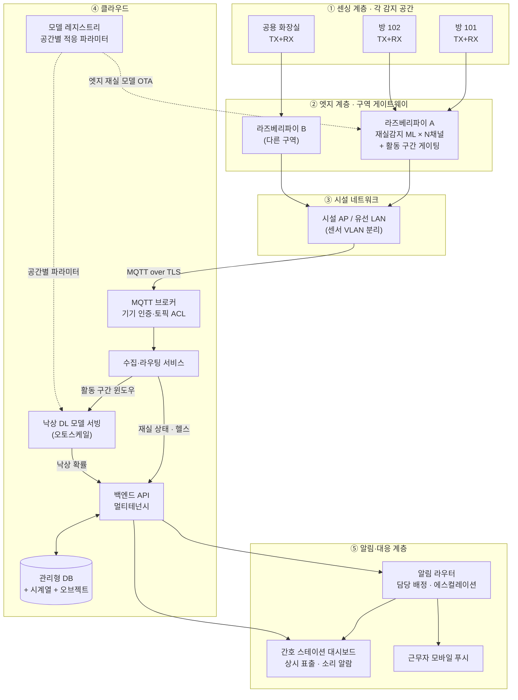
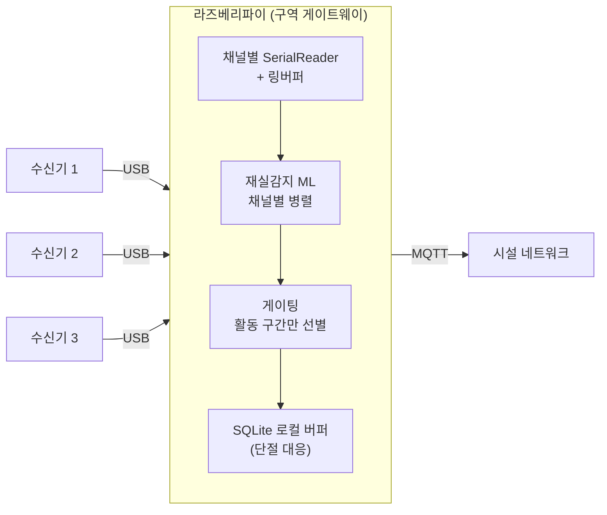
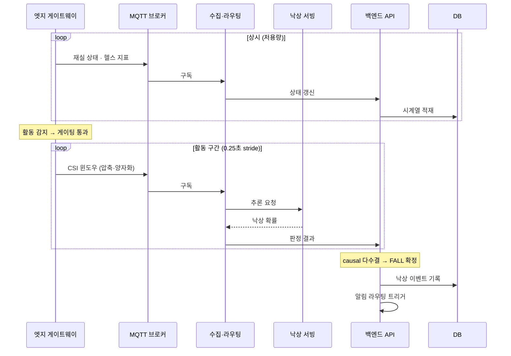
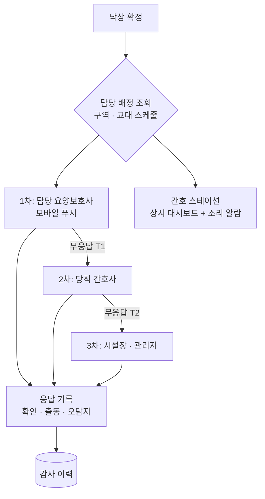
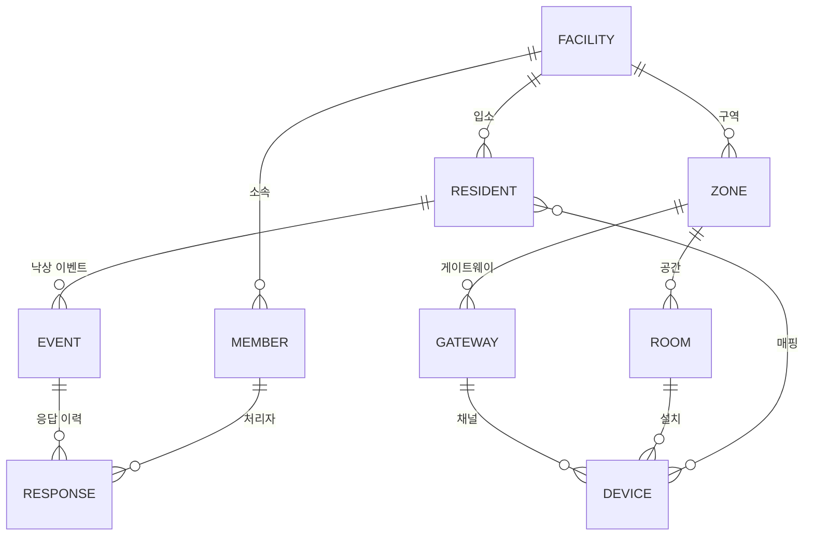

# FACILITY 서비스 시스템 파이프라인 구상도

**요양시설용 다입소자·다기기 관제 아키텍처**

작성일 2026-07-29 · v1.0
전제 문서: `CSI-Guard_구현현황_및_완성목표_v1.0_20260729.md`, `CSI-Guard_완성목표_실행계획_v1.0_20260729.md`

---

## 0. 문서 성격

현재 FACILITY는 **프런트엔드 인메모리 시뮬레이션만 존재**하고 실백엔드·DB·기기 연동이 없다. 이 문서는 HOME에서 검증된 파이프라인(엣지 라즈베리파이 + 클라우드)을 시설 규모로 확장할 때의 **구상**을 정리한 것이며, 확정 설계가 아니다. 수치는 모두 산정 근거와 함께 제시했으므로 실제 시설 조건에 맞춰 재계산해야 한다.

---

## 1. HOME과의 요구사항 차이

| 축        | HOME                          | FACILITY                             | 파급                            |
| --------- | ----------------------------- | ------------------------------------ | ------------------------------- |
| 감지 공간 | 1곳                           | 수십 곳(거실·침실·화장실·복도)       | 기기·엣지 대수 증가             |
| 대상자    | 1인                           | 수십 명                              | 입소자↔기기 매핑, 개인정보 규모 |
| 엣지      | 라즈베리파이 1대 = 수신기 1대 | **구역 게이트웨이 1대 = 수신기 N대** | 엣지 다중화 설계 필요           |
| 네트워크  | 가정용 공유기(2.4GHz)         | 시설 AP/유선 LAN, 보안 정책 존재     | VLAN·방화벽 협의                |
| 알림 대상 | 보호자 1~2명                  | **교대 근무자**(당직·담당 구역별)    | 라우팅·에스컬레이션 필요        |
| 관제      | 개인 스마트폰·PC              | **간호 스테이션 상시 대시보드**      | 상시 표출·소리 알람             |
| 책임      | 가족 대응                     | 시설의 법적 대응 의무                | **응답 이력의 증빙 가치**       |
| 가용성    | 끊겨도 가정 내 문제           | 다수 입소자 안전에 직결              | 이중화·폴백 필수                |

**핵심 차이 한 줄**: HOME은 "한 사람을 놓치지 않는 것"이 목표라면, FACILITY는 **"수십 명을 동시에, 교대 근무 체계 안에서, 증빙 가능하게"** 관제하는 것이 목표다.

---

## 2. 전체 파이프라인 구상도



---

## 3. 계층별 상세

### 3.1 ① 센싱 계층 — 기기 배치 전략

| 공간 유형       | 배치                                      | 우선순위                                     |
| --------------- | ----------------------------------------- | -------------------------------------------- |
| 화장실·욕실     | 공간당 1쌍                                | **최우선**. 낙상 최고위험 + 카메라 설치 불가 |
| 입소자 침실     | 실당 1쌍(다인실은 침상 간 구분 한계 있음) | 높음                                         |
| 복도·계단참     | 구간당 1쌍                                | 중간. 이동 중 낙상                           |
| 식당·프로그램실 | 넓어 다중 쌍 필요                         | 낮음. 직원 상주로 육안 관측 가능             |

**다인실의 한계를 먼저 인정해야 한다.** 현재 파이프라인은 공간 내 인원을 구분하지 않는다(재실은 이진 판정, 낙상은 윈도우 단위 판정). 2인실에서 "누가 낙상했는가"는 **현 구조로 판별 불가**하며, 침상별 링크 분리 또는 다중 링크 기반 위치 추정(G7의 확장 축)이 전제되어야 한다. 초기 도입은 **1인 사용 공간(화장실·1인실) 우선**이 현실적이다.

### 3.2 ② 엣지 계층 — 구역 게이트웨이

HOME의 "Pi 1대 = 수신기 1대"를 그대로 늘리면 대수가 감당되지 않는다. **구역(zone) 단위 게이트웨이**로 묶는다.



| 항목             | 내용                                                                                |
| ---------------- | ----------------------------------------------------------------------------------- |
| 수신기 수용 대수 | USB 포트 수와 CPU 여유로 결정. **Pi 4 기준 2~4채널이 현실적 상한 추정** — 실측 필요 |
| 채널 분리        | 채널당 독립 링버퍼·재실 인스턴스. 한 채널 장애가 다른 채널을 죽이지 않아야 함       |
| 게이팅           | 재실감지 결과로 클라우드 업로드 여부를 결정. **대역폭·추론 비용의 핵심 절감 장치**  |
| 로컬 버퍼        | 네트워크 단절 시 SQLite에 적재 후 복구 시 업로드                                    |
| USB 확장         | 채널이 많으면 USB 허브 필요. 전력 공급 여유 확인                                    |

> **선행 검증 항목**: 현행 재실 파이프라인은 채널당 0.25초마다 3초 윈도우를 재계산한다. Pi 1대가 몇 채널까지 이 주기를 지킬 수 있는지가 게이트웨이 배치 밀도를 결정한다. **G7의 Pi 벤치에서 반드시 채널 수를 변수로 측정**할 것.

### 3.3 ③ 시설 네트워크

| 항목         | 구상                                                                      |
| ------------ | ------------------------------------------------------------------------- |
| 연결         | 게이트웨이는 **유선 LAN 우선**(안정성). 배선 불가 구역만 Wi-Fi            |
| 대역 간섭    | 감지 링크는 5GHz ESP-NOW, 업링크는 유선 또는 2.4GHz → 대역 분리 유지      |
| 격리         | 센서 트래픽 전용 **VLAN 분리**. 시설 업무망·입소자 개방망과 분리          |
| 방화벽       | 아웃바운드 MQTT/TLS(8883)만 허용하면 충분. 인바운드 개방 불필요           |
| 시설 IT 협의 | 시설마다 네트워크 정책이 달라 **도입 전 협의가 실질적 병목**이 될 수 있음 |

### 3.4 ④ 클라우드 계층



| 구성요소        | 역할                                                              | 비고                                                     |
| --------------- | ----------------------------------------------------------------- | -------------------------------------------------------- |
| MQTT 브로커     | 기기 인증·토픽 ACL·수신                                           | 시설별·기기별 격리                                       |
| 수집·라우팅     | 채널별 스트림을 세션으로 복원, 추론 큐잉                          | 순서 보장·중복 제거                                      |
| 낙상 모델 서빙  | 윈도우 → 확률. 공간별 적응 파라미터 적용                          | 오토스케일. 배치 추론으로 처리량 확보                    |
| 백엔드 API      | 상태머신·이벤트·테넌시·권한                                       | causal 다수결·COOLDOWN은 서버 측에서 유지                |
| DB              | 관계형(입소자·기기·이벤트) + 시계열(지표) + 오브젝트(윈도우·모델) | 보존 기간 정책 필요                                      |
| 모델 레지스트리 | 공간별 낙상 적응 파라미터, 엣지 재실 모델                         | 공간이 수십 개 → **버전 관리 부담이 HOME과 차원이 다름** |

### 3.5 ⑤ 알림·대응 계층

FACILITY에서 **HOME과 가장 크게 갈라지는 지점.** 개인 푸시 하나로 끝나지 않는다.



| 항목          | 구상                                                                                   |
| ------------- | -------------------------------------------------------------------------------------- |
| 담당 배정     | 구역별 담당자 + 교대 스케줄 테이블. 시간대에 따라 수신자가 바뀜                        |
| 에스컬레이션  | 무응답 임계시간(T1/T2)은 시설 운영 규정에 맞춰 설정 가능해야 함                        |
| 스테이션 표출 | 상시 대시보드 + 소리 알람. **근무자가 휴대폰을 못 볼 상황을 전제**                     |
| 응답 기록     | 누가·언제·어떤 조치를 했는지. **시설의 대응 의무 증빙 자료**가 되므로 위변조 방지 필요 |
| 오탐지 처리   | 오탐지로 표시해도 **학습에는 반영하지 않는다**(G4 원칙). 운영 지표로만 집계            |

### 3.6 관제 화면 (이미 목업 존재)

현재 프런트엔드에 다입소자 실시간 관제·이력·이벤트 로그·기기 관리 화면이 구현되어 있다. 실서비스 전환 시 추가로 필요한 것:

- 구역/층 단위 뷰 전환, 다수 카드의 시각적 우선순위(위험 상태 상단 고정)
- 담당 배정·교대 스케줄 관리 화면
- 감사 로그 조회(누가 어떤 입소자 데이터를 열람했는가)
- 기기 헬스 일괄 점검(수십 대 중 오프라인 기기 즉시 식별)

---

## 4. 멀티테넌시·권한 모델



- 현행 도메인 모델(`Facility`/`UserAccount`/`Resident`/`Device`)에 **ZONE·GATEWAY·교대 스케줄·감사 로그**가 추가된다.
- 역할: ROOT(시설 등록자) / MEMBER(초대코드 참여). 실서비스에서는 **열람 범위를 담당 구역으로 제한**하는 세분화가 필요할 수 있다.
- 데이터 격리는 DB 쿼리 레벨에서 `facilityId` 스코핑을 강제한다(현재는 프런트 필터링 수준).

---

## 5. 스케일 산정 (예시)

**가정**: 입소자 50명, 감지 공간 35곳(1인실·화장실 우선), 게이트웨이 1대당 3채널.

| 항목                            | 산정            | 결과                |
| ------------------------------- | --------------- | ------------------- |
| 송수신 쌍                       | 공간당 1쌍      | 70대(TX 35 + RX 35) |
| 게이트웨이                      | 35 ÷ 3채널      | **약 12대**         |
| 재실 추론                       | 엣지에서 처리   | 클라우드 부하 없음  |
| 낙상 추론 요청(게이팅 없음)     | 35공간 × 4회/초 | 140 req/s           |
| 낙상 추론 요청(게이팅 20%)      | 140 × 0.2       | **약 28 req/s**     |
| 필요 CPU(42ms/req 가정)         | 28 × 0.042      | **약 1.2 코어**     |
| 업링크(원시 윈도우, 게이팅 20%) | 아래 계산 참조  | **약 11Mbps**       |

**업링크 계산 근거** (재계산할 수 있도록 식을 남긴다):

```
윈도우 크기 ≈ 160Hz × 3초 × 서브캐리어수 × 2(I/Q) × 1byte(int8)
            ≈ 480 × 52 × 2 = 약 50KB
초당 전송   = 50KB × 4회/초 × 35공간 × 0.2(게이팅) ≈ 1.4MB/s ≈ 11Mbps
```

> **중요**: 모델 입력 피처(S3 스칼로그램 224×224 + PCA-ACF 128×64 ≈ 232KB/윈도우)를 그대로 올리면 위 값의 4~5배가 된다. **원시 CSI 윈도우를 보내고 클라우드에서 피처를 추출하는 편이 대역폭상 유리**하다. 서브캐리어 수는 실제 수신기 설정으로 대체해 재계산할 것.

**게이팅이 없으면 성립하지 않는다**: 게이팅 0%일 때 업링크는 약 56Mbps, 추론은 약 6코어. 시설 규모가 커질수록 이 격차가 벌어지므로 **G7(엣지 재실감지)은 FACILITY의 선택이 아니라 전제**다.

---

## 6. 가용성·폴백 설계

| 장애 지점           | 영향                              | 대응                                                    |
| ------------------- | --------------------------------- | ------------------------------------------------------- |
| 수신기 1대 고장     | 해당 공간만 감지 중단             | 헬스 모니터링 → 대시보드 즉시 표시                      |
| 게이트웨이 1대 다운 | **해당 구역 전체 중단**           | 구역 단위 장애 알람. 예비 게이트웨이 확보               |
| 시설 인터넷 단절    | **낙상 감지 중단**(클라우드 추론) | 재실감지는 엣지에서 유지. **온프레미스 추론 폴백 검토** |
| 클라우드 장애       | 전 시설 낙상 감지 중단            | 다중 AZ. 상태를 대시보드에 명시적으로 표시              |
| 근무자 무응답       | 대응 지연                         | 에스컬레이션 체인(§3.5)                                 |

**온프레미스 하이브리드 옵션**: 시설 내 소형 서버 1대에 낙상 추론을 두고, 클라우드는 관리·이력·모델 배포만 담당하는 구성. 인터넷 의존을 끊을 수 있고 업링크 비용도 사라지지만, 시설마다 서버를 설치·관리해야 한다. **시설 규모가 크고 회선이 불안정할수록 유리**하므로, 도입 시설의 조건에 따라 선택지로 두는 것이 현실적이다.

---

## 7. HOME 대비 신규 구성요소

| 구분     | 신규 항목                                                       |
| -------- | --------------------------------------------------------------- |
| 하드웨어 | 구역 게이트웨이(다채널 Pi), USB 허브, 유선 배선, 예비 기기      |
| 엣지 SW  | 채널 다중화, 채널별 장애 격리, 게이트웨이 원격 관리             |
| 클라우드 | 수집·라우팅 서비스, 추론 오토스케일, 멀티테넌시 격리, 감사 로그 |
| 도메인   | ZONE·GATEWAY 엔티티, 교대 스케줄, 담당 배정, 에스컬레이션 규칙  |
| 알림     | 라우터, 스테이션 대시보드(소리 알람), 다단계 에스컬레이션       |
| 운영     | 기기 일괄 헬스 점검, 대량 캘리브레이션 절차, 시설 IT 협의       |
| 규제     | 입소자 개인정보 처리방침, 보존 기간, 열람 감사                  |

---

## 8. 단계적 구축 로드맵

| 단계 | 범위                              | 검증 목표                                   |
| ---- | --------------------------------- | ------------------------------------------- |
| 0    | 랩 환경 게이트웨이 다채널 시험    | Pi 1대당 수용 채널 수 확정                  |
| 1    | **1개 구역 파일럿**(화장실 2~3곳) | 게이팅 실효성, 업링크 실측, 오탐률          |
| 2    | 1개 층 확장                       | 게이트웨이 다중화, 알림 라우팅·에스컬레이션 |
| 3    | 전관 확장                         | 스케일 부하, 운영 절차, 감사 체계           |
| 4    | 다시설                            | 테넌시 격리, 배포 자동화, 온프레미스 옵션   |

**1단계를 화장실부터 여는 이유**: 낙상 위험이 가장 높고, 1인 사용이라 다인실 판별 한계(§3.1)를 피할 수 있으며, 카메라 대안이 없어 도입 명분이 가장 뚜렷하다.

---

## 9. 미결정 사항

1. **다인실 대응**: 침상별 링크 분리 / 다중 링크 위치 추정 / 1인 공간 한정 중 선택. **초기 도입 범위를 결정하는 항목.**
2. **게이트웨이 채널 밀도**: Pi 1대당 몇 채널인가. §3.2 벤치 결과에 종속.
3. **온프레미스 추론 여부**(§6): 시설 규모·회선 조건에 따라 클라우드 단독 vs 하이브리드.
4. **전송 페이로드**: 원시 CSI 윈도우 vs 피처. §5 계산상 원시가 유리하나 실측 필요.
5. **에스컬레이션 정책**: 무응답 임계시간·차수. 시설 운영 규정과 맞물림.
6. **개인정보 처리 범위**: 입소자 데이터의 클라우드 저장 가능 여부·리전·보존 기간. **법무 검토 선행 필요.**
7. **기존 시설 시스템 연동**: 간호기록·호출벨 등과의 통합 여부.

---

## 참고

- 현재 FACILITY 구현 상태와 목표: `CSI-Guard_구현현황_및_완성목표_v1.0_20260729.md`
- 목표별 실행 계획·기술 스택: `CSI-Guard_완성목표_실행계획_v1.0_20260729.md`
- 감지 알고리즘 원리: `CSI-Guard_재실감지_알고리즘_상태머신_보고서_v2.0_20260720.md`
